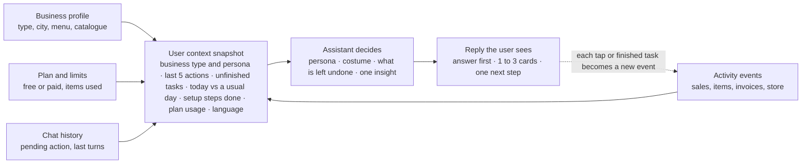
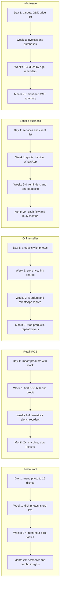
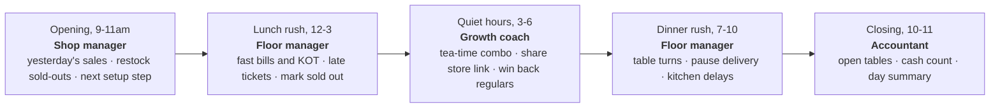
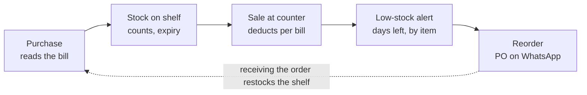
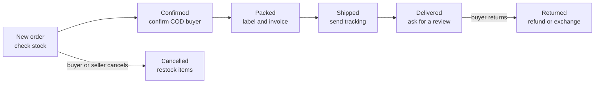

# Duxbe AI: Business-Aware Assistant Playbook

Sep 30, 2026 · @stupidmoron

## Summary

The Duxbe assistant should act like a manager who already knows the shop. It should remember what the owner did last and see what is left unfinished. It should behave like the business type it serves, and it should never end a reply without a next step.

This playbook turns 670 real exchanges from Supabase (18 Jun to 27 Sep 2026, 110 businesses) into a working design for that behaviour. It covers:

- **Context:** what the assistant must know about every user before it replies, including to a plain "hi".
- **Personas:** how it changes behaviour for a restaurant, a retail counter, an online seller, a service business or a wholesaler. It also covers the "costume" it wears for each job: manager, analyst, store builder or accountant.
- **Module loops:** for each Duxbe module, what the user can do by chat, the prompts that trigger it, the reply and card they should see, and the hook into the next task.
- **Frequent prompts:** the messages people actually send, with an interactive reply for each.

**How to use it:** product decides the persona and nudge rules (sections 4, 8 and 11). Design builds the card library (section 10). Engineering builds the context layer (section 3), then wires each module loop (section 6). The loops are written as templates. Anything in `{braces}` is filled from the user's live data.

**Assumptions:**

- Many earlier sessions were internal testing (WhatsApp invoices, test customers such as Jithu, Nimisha and Andrew). Those were used to learn how the tools behave, not to count real demand.
- Plan rules come from you: the free plan allows 15 items, plus dish images for those 15. A subscription adds more items, more themes and a website the owner can create and customise.
- Module names follow the tools seen in the logs. Any module the logs don't show (purchases, staff roles, tables) is marked as needing confirmation.

## How users actually talk to the AI

Users type like they text a shop assistant: short, one-off, often misspelled, and they expect it to already know the context. The median message is 3 words. 147 of 670 messages (22%) are a single word.

| Message style | Share or count | Real examples from the logs | What the AI must do |
| --- | --- | --- | --- |
| One or two words | 147 single-word messages | "hi", "website", "tea", "menu", "coffee", "andrew", "all" | Treat the word as a topic plus context, then act. "andrew" after an invoice question means "use Andrew". |
| Suggestion chips | about 90 taps | "Add New Product", "Today's Sales", "Check Stock Levels", "Send invoice to Customer" | Chips must lead to a working result on the user's plan, never a dead end. |
| Confirmations | 40 | "yes", "confirm", "ok", "kk", "yeah", "paid" | Run the one pending action. Never guess a new one. |
| Button clicks | 40 | "\[button\_click\] Apply", "Send via WhatsApp", "Select INV-000010", "6 tables" | A click is consent. Act, then show the result. |
| Bare numbers | 8 | "2", "50", "180", "6 units 18 rs" | Read them as the answer to the last question (a choice, a price or a quantity). |
| Shorthand data | about 20 | "mutta - 1 - 7", "chocolate - goods - 20", "milk:30 egg:8 sugar:60" | Parse name, quantity and price. Show one preview card for all of them. |
| Pasted menus and price lists | 13 over 20 words | a full pickle price list, a starters and soups menu | Offer bulk add straight away, with a review card. |
| Malayalam and Manglish | 7 | "start your booking ennu venam", "settings add user കാണുന്നില്ല", "malayalam para" | Understand it, and reply in the user's language when asked. |
| Frustration | about 10 | "why so much time taken", "no youre wrong", "I already told you that" | Apologise in one line, show progress, and never ask the same question twice. |
| Out-of-scope website asks | about 25 | resort booking system, esports site, courier site, a learning platform with MCQs | Say what Duxbe's store can do today, then offer the nearest thing it can build. |

**What this means for design:**

1. **Context beats wording.** Most messages only make sense with the last turn and the user's data. The context layer in section 3 is the foundation of everything else.
2. **Cards beat typing.** Users already prefer tapping. Every reply should end in one to three buttons.
3. **One question at most.** Many replies today ask a clarifying question (24% of all replies). Where the context is clear, act instead of asking.
4. **Users bring their business with them.** They name dishes (biryani, shawarma, parotta), products (Adidas Samba, office chair), rentals (a Maruti Swift at ₹1,500 a day) and services (photography, counselling). The AI should pick up the business type from these.

## The user context layer

The assistant cannot be personal until it reads a small, fresh snapshot of the business before every reply. Today "hi" gets the same template 53 times out of 60, and a bare "yes" loses its meaning in more than half of cases. Both problems come from missing context.

Every module writes an event when something happens. A job folds those events into one snapshot per business. The assistant reads the snapshot, not the raw tables, so a greeting stays fast and cheap.

**What goes in the snapshot:**

| Field | Example value | Source | Used for |
| --- | --- | --- | --- |
| Business type and persona | restaurant, dine-in plus online | signup answer, item names, tables set up | Tone, vocabulary, which loops to suggest |
| Setup progress | items 9 of 15, store not live, no logo | item count, store status | Unfinished-work nudges |
| Last 5 actions | "Created invoice INV-000019 for Jithu, 2 days ago" | activity events | "Pick up where you left off" |
| Open loops | draft sale not confirmed, import stopped at review | pending actions, drafts | Resume cards |
| Today versus usual | 3 bills today, usually 11 by this hour | sales by hour, last 4 weeks | Insights |
| Money owed | 4 customers owe ₹8,200, oldest 12 days | invoices | Reminder nudges |
| Stock watch | 4 items out of stock, 2 bestsellers low | inventory | Restock nudges |
| Plan usage | free plan, 12 of 15 items used | subscription | Honest limits and upgrade moments |
| Habits | opens at 9am, bills in the evening, uses POS not invoices | event times | When to nudge and what to suggest |
| Language | English with Malayalam words | chat history | Reply language |
| Pending action | "send INV-000010 to Jithu on WhatsApp" | last assistant turn | Makes "yes" and button clicks work |

**Build notes:**

1. **Event log.** One row per action: `business_id`, `module`, `action`, `object_id`, `summary`, `created_at`. Every write from a screen or from chat goes here, including form submits and card clicks, which are not logged today.
2. **Snapshot job.** Rebuild the snapshot on each event, or at least every 15 minutes. Keep it under about 1,500 tokens so it can ride along with every prompt.
3. **Pending action.** Store it in the session with an expiry of about 10 minutes. "yes", "ok" and "confirm" only ever run this stored action.
4. **Times in IST.** Store in UTC, but compute "today" in the business's own time zone. This is the likely cause of "check properly, today I already made 2 sales".
5. **Privacy.** The snapshot holds counts and short summaries, not full customer records. Only look up detail when the user asks.

## Business types and AI costumes

The assistant should behave on two layers. The **persona** is fixed by the business type and sets vocabulary, defaults and which loops come first. The **costume** changes with the task and sets the voice: builder, manager, analyst or accountant.

### Personas (who the business is)

The logs already show all five of these types.

| Persona | Seen in the logs | What they want from Duxbe | Words the AI uses | First loops to push |
| --- | --- | --- | --- | --- |
| **Restaurant and café** (dine-in, takeaway, cloud kitchen, juice shop, bakery) | biryani, shawarma, parotta, sadhya, waffles, juice kiosk, "6 tables", "generate dish image" | Fast billing, menu online, dish photos, tables, bestsellers | menu, dish, order, table, KOT, rush hour | Menu to items, dish images, online store, tables, today's bestsellers |
| **Retail POS** (grocery, fancy store, footwear, supermarket) | milk, egg, tea powder, "fancy items", Adidas Samba, "restock item" | Quick bills, stock and reorders, credit customers | product, stock, reorder, MRP, credit, bill | Bulk import, POS sale, low stock, dues and reminders |
| **Online seller** (home brands, D2C, dropshipping) | pickle price list, "Meesho dropshipping store", "cute items shopping", "how order on online store" | A good-looking store, product pages, a share link, orders | store, product page, link, order, theme | Online store, themes, share link, product photos, orders |
| **Service business** (photography, counselling, consultancy, events, rentals, workshops, resort) | "my business is photography", Maruti Swift rental ₹1,500 a day, counselling, courier, event management | Quotes and invoices, getting paid, a simple site, bookings | client, quote, invoice, booking, due | Customer to quote to invoice to WhatsApp, reminders, a one-page site |
| **Wholesale and distribution** (B2B suppliers) | office chair × 3 at ₹7,999, "purchase summary", country-wise tax | Invoices with GST, purchases, receivables, reports | party, purchase, GST, credit period, outstanding | Invoices, purchases, receivables ageing, P&L |

**How the AI picks the persona:**

1. **Ask on the landing that brought them.** Duxbe Restaurant asks "What kind of place are you running?" (dine-in, quick service and takeaway, cloud kitchen), then which modules to turn on. A retail landing asks "What do you sell?", a services landing asks "What service do you offer?", and a generic landing shows 5 picture cards.
2. **Confirm it silently from signals.** Tables set up means dine-in. Per-day pricing means rental or service. A store with no POS sales means online seller.
3. **Allow a mix.** One business can mix two types, such as a restaurant with an online store. The primary persona leads and the second adds its loops.

### Costumes (what job the AI is doing right now)

| Costume | Worn when | Voice and behaviour | Example opening line |
| --- | --- | --- | --- |
| **Setup guide** | Setup is under 70% complete, or it's the first week | Warm, step by step, celebrates small wins | "2 steps left and your shop is ready to bill." |
| **Store builder** | Website, theme, logo or photo requests | Visual, shows a preview before asking | "Here's how your store looks with Bistro." |
| **Shop manager** | Daily use: sales, stock, bills, staff | Brief, action first, flags problems | "3 bills so far. Chicken biryani is almost out." |
| **Analyst** | Asks about "trend", "report", "best" or "compare", and the weekly review | Numbers first, one chart, one takeaway | "Sales are up 18% on last week, led by weekends." |
| **Accountant** | Invoices, dues, expenses, P&L, GST | Precise, careful with money, always shows totals | "4 customers owe ₹8,200. Send reminders to all 4?" |
| **Growth coach** | Quiet days, low repeat customers, a store with no visits | Practical ideas based on their own data | "Your store link hasn't been shared yet. Share it on WhatsApp status?" |

The same restaurant owner might meet all six in one week. The setup guide appears on Monday, the shop manager during lunch rush, the analyst on Sunday night, and the accountant at month end.

## Context-aware greetings

A "hi" is the most common message (67 of 670), and today 53 of 60 get the same capability list. Instead, the greeting should read the snapshot and lead with the single most useful thing. The format is always the same:

**Greeting line** (their name or shop) + **one status line** (what's true right now) + **one suggestion** + **up to 3 buttons**.

### Pick the first state that matches

The order matters: unfinished work comes before good news, and good news comes before generic tips.

| # | User state (from the snapshot) | Reply | Buttons |
| --- | --- | --- | --- |
| 1 | **Pending action** from the last session, under 24 hours old | "Hi Arjun. Yesterday you started a sale for Megha (Mutta × 1, ₹7) but didn't confirm it. Finish it now?" | \[Confirm sale\] \[Edit\] \[Discard\] |
| 2 | **Brand new**, 0 items | "Hi, welcome to Duxbe. Let's get {shop} ready to bill in 2 minutes. What do you sell?" | \[Food and drinks\] \[Products\] \[Services\] |
| 3 | **Setup half done**, such as 6 items and no store | "Hi Sana. {shop} has 6 items. 2 more steps and your online store is live." | \[Add more items\] \[Build my store\] |
| 4 | **Stopped import** or a menu upload left at review | "Hi. Your menu upload found 24 dishes but they're not added yet. Review and add them?" | \[Review 24 dishes\] \[Upload again\] |
| 5 | **Something urgent**: out-of-stock bestseller, or dues over 7 days | "Good morning. Chicken biryani sold out yesterday at 2pm, and 3 customers owe ₹4,200." | \[Restock biryani\] \[Send reminders\] |
| 6 | **Good news**: record day or best week | "Hi Ravi. Yesterday was your best Saturday yet: ₹18,400 from 61 bills." | \[See what sold\] \[This week\] |
| 7 | **Quiet period**: no activity for 3+ days | "Welcome back. Since Tuesday, 2 online orders came in and are waiting." | \[See orders\] \[Today's sales\] |
| 8 | **Routine day**, nothing special | "Hi Arjun. 3 bills so far today, ₹1,240. A usual day has 11 by now." | \[New sale\] \[Today's report\] \[Add product\] |
| 9 | **Snapshot unavailable** | "Hi. What would you like to do?" | \[New sale\] \[Add product\] \[Today's sales\] |

### The same state, different personas

State 3, "setup half done", in each persona's voice:

- **Restaurant:** "Hi. Your menu has 9 dishes in Duxbe. Want me to make photos for them? Free covers up to 15 dishes." \[Make dish photos\] \[Add more dishes\]
- **Retail POS:** "Hi. 40 products are in, but none have stock counts yet. Add stock so I can warn you before things run out." \[Add stock now\] \[Import from Excel\]
- **Online seller:** "Hi. Your store looks good, but nobody has seen it yet. Share your link on WhatsApp status to get your first order." \[Copy store link\] \[Share on WhatsApp\]
- **Service business:** "Hi. You have 3 clients saved. Send your first invoice on WhatsApp. It takes 20 seconds." \[Create invoice\] \[Create quote\]
- **Wholesale:** "Hi. Add your GST number once and every invoice will show tax correctly." \[Add GST number\] \[Later\]

### Other greeting rules

- **Time of day.** Morning shows yesterday's summary. Afternoon shows today so far. After closing, show the end-of-day summary.
- **Don't repeat yourself.** If a nudge was shown twice and ignored, drop it for 7 days.
- **"hello" in Malayalam or Manglish.** Reply in the same style if the user has written that way before.
- **Second "hi" in the same session.** Don't greet again. Say "I'm here. Want to continue with {last task}?"

## Module-by-module loops

Every module runs the same six-step loop. What changes is the card and the next hook.

1. **Trigger.** A typed prompt, a chip, a button or a greeting nudge.
2. **Fill from context.** Use the snapshot and last turns to fill in what the user didn't say: customer, item, period.
3. **Preview card.** Show what will happen, with real names, amounts and totals. Skip this for read-only answers.
4. **One tap.** Confirm, edit or cancel. A button click is consent, so never ask twice.
5. **Done card.** Say exactly what happened, with IDs and amounts.
6. **Next-step hook.** Offer 1 to 3 follow-ups chosen from the persona and snapshot. This is what keeps users moving.

Each module below lists what users can do by chat, the real prompts that trigger it, the loop with sample replies, and the hooks to show afterwards.

### 6.1 Products and menu

**Can do by chat:** add one item, add many from a typed list, import from a menu photo, PDF or Excel sheet, edit price or category, add stock, generate dish or product photos, check the item limit.

**Trigger prompts seen:** "Add New Product" (24), "create item", "add cup cake of price 200 and category of bakery", "mutta - 1 - 7", "add items by reading menu", "upload menu", a pasted pickle price list, "generate dish image for me", "item creation limit".

| Step | User | AI reply | Card |
| --- | --- | --- | --- |
| Trigger | "add cup cake 200 bakery" | "Adding this item:" | Item preview: Cup cake · ₹200 · Bakery. \[Add\] \[Edit\] |
| Bulk | pastes 12 lines or uploads a menu | "I found 24 dishes in 5 categories. Check them before I add." | Review table: name, price, category, with a tick box per row. \[Add all\] \[Fix\] |
| Limit | on the free plan with 24 dishes | "Free covers 15 items. Pick your top 15, or upgrade to add all 24." | \[Pick top 15\] \[See plans\] |
| Done | taps Add | "Cup cake is added at ₹200. You now have 10 of 15 free items." | Done card |

**Next-step hooks:**

- Restaurant: "Make photos for your 10 dishes?" \[Make dish photos\]
- Retail: "Add opening stock so I can warn you when it runs low?" \[Add stock\]
- Online seller: "Your store will show this item. Take a look?" \[View store\]
- Everyone, 3+ items: "Ready to make your first bill?" \[New sale\]

### 6.2 Sales and POS billing

**Can do by chat:** create a sale for a named or walk-in customer, mark it paid or unpaid, choose the payment mode, settle a pending sale, change its status, and (to be confirmed) handle a sale return.

**Trigger prompts seen:** "create sale", "POS sale for nimisha", "make a pos sale for customer nimisha, item mutta, quantity 1 and amount is paid", "kotta x 1 paid", "sale of 2 adidas samba to john", "settle sale-000036", "how to create sale return".

| Step | User | AI reply | Card |
| --- | --- | --- | --- |
| Trigger | "2 biryani 1 lime juice for table 4, paid by UPI" | "Here's the bill:" | Sale preview: Table 4 · Chicken biryani × 2 @ ₹220 · Lime juice × 1 @ ₹40 · **Total ₹480** · Paid (UPI). \[Confirm\] \[Edit\] |
| Missing piece | "create sale for Megha" | "What did Megha buy? For example: mutta 2" | Item picker with the top 6 sellers as chips |
| Settle | "settle the previous sale" | "SALE-000036 for Megha has ₹7 due. Mark it paid?" | \[Cash\] \[UPI\] \[Card\] |
| Done | taps Confirm | "Sale SALE-000041 is saved: ₹480, paid by UPI. That's 12 bills today." | Done card with \[Print\] \[Send on WhatsApp\] |

**Rules:** never show a preview with no items or no total. Keep the customer and "paid" exactly as typed. Send "how to" questions to a guide, not to the sale tool.

**Next-step hooks:**

- Named customer: "Send Megha the bill on WhatsApp?" \[Send\]
- Item stock falling: "Only 3 chicken biryani portions left in stock." \[Update stock\]
- End of day: "Close today? You made ₹12,400 from 38 bills." \[See summary\]

### 6.3 Invoices, quotes and WhatsApp

**Can do by chat:** create an invoice or a quotation, list invoices, send an invoice on WhatsApp, turn a quote into an invoice, record a payment against an invoice.

**Trigger prompts seen:** "Send invoice to Customer" (11), "create an invoice for jithu for the rental of maruti suzuki swift 1500 per day for 3 rental days", "create an invoice for rahul for 4 chicken biryani priced 220", "create a quotation for andrew", "list existing invoices", "send invoice inv-00008 through whatsapp".

| Step | User | AI reply | Card |
| --- | --- | --- | --- |
| Trigger | "invoice Jithu Swift rental 1500 a day for 3 days" | "Here's the invoice:" | Invoice preview: Jithu · Maruti Swift rental · 3 days × ₹1,500 · **Total ₹4,500** · Due in 7 days. \[Create and send\] \[Create only\] \[Edit\] |
| Which invoice? | "send invoice" | "Which invoice? Here are your latest unpaid ones:" | List: INV-000010 · Jithu · ₹500 \[Send\] / INV-000009 · Rahul · ₹880 \[Send\] |
| New customer | "create customer Farhan +91 88488 56819 and send invoice for web development 25000" | "I'll add Farhan and create this invoice:" | Customer and invoice preview together. \[Do both\] |
| Done | taps Send | "Sent. INV-000010 (₹500) went to Jithu on WhatsApp." | Done card |

**Next-step hooks:**

- "Remind Jithu automatically if it's unpaid in 7 days?" \[Turn on reminder\]
- Services: "Save 'Swift rental, per day' as a product for next time?" \[Save\]
- Quote sent: "Turn this quote into an invoice when Andrew agrees." \[Convert later\]

### 6.4 Customers

**Can do by chat:** add a customer, find one, update phone or email, see their history and dues, import a customer list.

**Trigger prompts seen:** "create customer jithu, 916238642168", "is there any customer named helena", "update customer email", "get customer adress", "import customer", "how to catch customers".

| Step | User | AI reply | Card |
| --- | --- | --- | --- |
| Trigger | "add customer Saniya 98470 12345" | "Adding Saniya:" | Customer preview: Saniya · +91 98470 12345. \[Save\] \[Add email\] |
| Look-up | "helena" | "Helena has bought 6 times, spent ₹3,400 in total, and owes ₹600." | Customer card: last visit, top item, dues. \[New sale\] \[Send reminder\] |
| Done | taps Save | "Saniya is saved." | Done card |

**Next-step hooks:**

- "Make a sale or invoice for Saniya now?" \[New sale\] \[New invoice\]
- Retail and restaurant: "12 customers haven't come back in 30 days. Send them an offer?" \[Pick customers\]

### 6.5 Payments and reminders

**Can do by chat:** see who owes money, send WhatsApp reminders to one customer or all, mark an invoice paid, see receivables by age.

**Trigger prompts seen:** "Send payment reminders.", "send payment reminder to helena", "is there any pending sales?", "pending bill".

| Step | User | AI reply | Card |
| --- | --- | --- | --- |
| Trigger | "send payment reminders" | "4 customers owe ₹8,200. The oldest is 12 days." | Dues list with a tick box each: Jithu ₹4,500 (12 days), Rahul ₹880 … \[Remind selected\] |
| Progress | taps Remind | "Sending reminders to 4 customers. This takes about 15 seconds." | Progress bar |
| Done |  | "Reminders sent to 4 customers." | Done card with each name and amount |
| Nothing due |  | "Nobody owes you money right now. Nice." | \[See paid invoices\] |

**Next-step hooks:**

- "Turn on automatic reminders every 7 days?" \[Turn on\]
- Accountant view: "You've collected ₹14,000 this month. See it next to your expenses?" \[See cash flow\]

### 6.6 Stock, inventory and purchases

**Can do by chat:** see stock levels, see low-stock and out-of-stock items, restock, record a purchase from a supplier, see a purchase summary. Purchases need confirming, since only one prompt used them.

**Trigger prompts seen:** "Check Stock Levels" (7), "Which products are running low?" (6), "show me products i should restock", "restock item", "purchase summary", "today's purchase".

| Step | User | AI reply | Card |
| --- | --- | --- | --- |
| Trigger | "check stock" | "9 products: 5 in stock, 4 out of stock. Stock is worth ₹1,500." | Stock card: out of stock first, each with \[Restock\] |
| Restock | "restock banana 50" | "Adding 50 to Banana. New stock is 50." | \[Confirm\] |
| Plan locked | free plan | "Full low-stock alerts come with a subscription. On your plan, I can show your 4 out-of-stock items now." | \[Show them\] \[See plans\] |
| No stock data | items but no counts | "I can't warn you about low stock until items have stock counts. Add them in one go?" | \[Add stock for all items\] |

**Next-step hooks:**

- "Record this as a purchase from your supplier, so your costs are tracked?" \[Record purchase\]
- "Want a daily alert at 9am when something is low?" \[Turn on alert\]

### 6.7 Expenses

**Can do by chat:** record an expense from one line, see this month's expenses, compare with last month, see categories.

**Trigger prompts seen:** "Show this month's expenses." (6), "create expense", "create expense for meghs for rs 100", "today's expenses", "expense of the month".

| Step | User | AI reply | Card |
| --- | --- | --- | --- |
| Trigger | "rent 8000 paid today" | "Recording this expense:" | Expense preview: Rent · ₹8,000 · today · Paid. \[Save\] \[Edit\] |
| Look-up | "this month's expenses" | "₹12,300 so far in September. Rent is the largest at ₹8,000." | Category bar and \[Compare with August\] |
| Empty |  | "No expenses recorded for September yet. Type one, like 'Gas 950 today'." | \[Add expense\] |

**Next-step hooks:**

- "You've recorded sales and expenses. Want to see your profit for the month?" \[See profit\]
- "Rent repeats every month. Remind you on the 1st?" \[Set reminder\]

### 6.8 Online store, themes and share link

**Can do by chat:** build the store from existing items, preview and apply a theme, activate the store, get and share the store link, change the logo, photos and hero text. With a subscription: more themes and a website they can create and customise.

**Trigger prompts seen:** "website" (and about 60 variants), "setup storefront for me", "Recommend a theme for my online store" (7), "change theme", "apply elegant theme", "online store is inactive", "give me my store link", "how to share my store link", "my store change this photo", "open my website in google".

| Step | User | AI reply | Card |
| --- | --- | --- | --- |
| Trigger | "website" | "Let's put {shop} online. I'll use your 12 items and business name. It takes about a minute." | \[Build my store\] \[Choose a theme first\] |
| Theme | "recommend a theme" | "For a café, Bistro works best: food-friendly and clean." | Theme preview image. \[Apply Bistro\] \[See all themes\] |
| Apply | taps Apply | "Bistro is live on your store." | Done card. \[View my store\] |
| Share | "give me my store link" | "Here's your link: connect.duxbe.com/{shop}" | \[Copy link\] \[Share on WhatsApp\] \[Show QR code\] |
| Outside scope | "resort booking site with staff attendance" | "Duxbe builds a store and booking-style pages for your business, but not a full staff system yet. I can set up a page listing your rooms with a Book button." | \[Set that up\] \[Tell me more\] |
| Upgrade moment | wants a locked theme | "Elegant comes with a subscription, along with more themes and full website editing. Want to preview it first?" | \[Preview Elegant\] \[See plans\] |

**Next-step hooks:**

- Store just built: "Share it on WhatsApp status to get your first visitors." \[Share\]
- Restaurant: "Your dishes don't have photos yet. Make them now? Free covers up to 15 dishes." \[Make photos\]
- Online seller: "Add a QR code to your packaging so buyers come back." \[Get QR code\]

### 6.9 Reports and insights

**Can do by chat:** today's and this week's sales, trends, bestsellers, item-level sales ("how many chicken shawarma today"), expense and purchase summaries, profit and loss, business health score, and (to be confirmed) custom reports with filters.

**Trigger prompts seen:** "Today's Sales" (18), "What were my sales today?", "How are my sales trending this week?", "what are my top selling products?", "how much shawarma sold today how many beef and how many chicken", "profit and loss", "check business health", "i want a report with date filtering + customer name + email + product + order status".

| Step | User | AI reply | Card |
| --- | --- | --- | --- |
| Trigger | "today's sales" | "₹29,295 from 92 orders so far, 12% above a usual Friday." | Sales card with a mini hour-by-hour chart. \[Top items\] \[Compare\] |
| Item detail | "how many beef and chicken shawarma today" | "Chicken shawarma 41, beef shawarma 17." | Item table |
| Empty | ₹0 today | "No sales yet today. Yesterday you made ₹450 from 3 sales." | \[Record a sale\] \[This week\] |
| Plan locked | business health on the free plan | "The full health report comes with a subscription. Here's what I can tell you for free: sales are steady and 4 items are out of stock." | \[Restock\] \[See plans\] |

**Next-step hooks:**

- "Want this summary on WhatsApp every night at 10pm?" \[Turn on daily summary\]
- Analyst: "Weekends make 46% of your sales. Want to see which items drive that?" \[Show me\]

### 6.10 Restaurant tables (to confirm)

**Can do by chat:** set up tables and areas, and (if supported) take an order for a table.

**Trigger prompts seen:** "\[button\_click\] 6 tables", "create 2 table capacity table of two in the area indoor and 2 tables of capacity 4". The guardrail blocked the second one, and the first answered with a raw tool name ("I can perform SetupTablesTool").

| Step | User | AI reply | Card |
| --- | --- | --- | --- |
| Trigger | "2 tables for 2 and 2 tables for 4, indoor" | "Setting up the Indoor area with 4 tables:" | Table layout preview: T1 (2), T2 (2), T3 (4), T4 (4). \[Create\] |
| Done |  | "4 tables ready in Indoor." | \[Add outdoor area\] \[Start a table order\] |

### 6.11 Settings, plan and staff

**Can do by chat:** check plan limits and AI credits, add staff and set roles, change the business email or phone, set up tax, connect a printer (guide).

**Trigger prompts seen:** "item creation limit", "what is my pos sales per month limit?", "what is my ai credit balance" (blocked twice), "how can I add my staff?", "settings add user കാണുന്നില്ല" ("I can't see add user"), "i want to change my email", "how to configure country wise tax rules", "how can I connect the printer".

| Step | User | AI reply | Card |
| --- | --- | --- | --- |
| Limits | "item creation limit" | "You're on the free plan: 12 of 15 items used. A subscription adds more items, more themes and full website editing." | Usage meter. \[See plans\] |
| Staff | "how can I add my staff?" | "Tell me their name and phone, and choose what they can do." | Staff form: name, phone, role (Cashier, Manager). \[Invite\] |
| Guide | "how can I connect the printer" | 3 short numbered steps | \[Open printer settings\] |

**Next-step hooks:**

- After adding staff: "Want a daily report of each cashier's sales?" \[Turn on\]
- Near a limit (13 of 15): "2 free items left. Pick which dishes matter most." \[Review items\]

## Vertical playbooks

Each business type needs a different first month, and the assistant should steer towards it one step at a time. Day 1 matters most: a user who gets real items into Duxbe on day 1 has a reason to come back.

*The Day 1 step in each lane decides whether a new user stays.*

The AI keeps each user on their lane. It offers the next box when the current one is done, and it never pushes a step from another lane before the user's own lane is working.

**Rituals that keep each type coming back:**

| Persona | Daily habit the AI builds | Weekly ritual | Monthly moment | Natural upgrade moment |
| --- | --- | --- | --- | --- |
| Restaurant | Morning: yesterday's sales and sold-out dishes. Night: a closing summary. | Monday: last week's top 5 dishes and slowest hour | "Your best month yet?" plus a menu price review | Menu over 15 dishes, or wanting a premium theme |
| Retail POS | Morning: low-stock list with \[Reorder\] | Friday: slow movers to discount | Stock value and margin by category | Over 15 products, or wanting full low-stock alerts |
| Online seller | New orders and unread questions | Store visits versus orders, and one tip | Top products and repeat buyers | Custom domain, more themes, full site editing |
| Service business | Today's bookings and unpaid invoices | Dues over 7 days with \[Remind all\] | Earnings by service and busiest weeks | A customised website, more services |
| Wholesale | Payments due today, by party | Receivables ageing | Profit and GST summary for filing | More items, custom reports |

**Tasks the AI hands out** (one at a time, as a "next up" card):

- **Restaurant:** photograph your top dish, add combo meals, set table numbers, share the menu link, set up a lunch-rush alert.
- **Retail POS:** set reorder levels for your top 10, add supplier details, record today's purchase, mark credit customers.
- **Online seller:** add a banner, write an about line, share on WhatsApp status, add delivery charges, answer your first order.
- **Service business:** save your 3 main services with prices, create a quote template, turn on auto reminders, publish a one-page site.
- **Wholesale:** add GST details, set credit days per party, import your price list, record supplier bills.

## Restaurant loops in detail

For a restaurant, the assistant is a floor manager who already knows the checklist on Home. It finishes setup one step at a time, runs billing and the kitchen during rush hours, and turns each day's numbers into one useful tip. Everything below follows the Duxbe Restaurant screens:

- **Get started:** phone or Google.
- **What kind of place are you running?:** dine-in, quick service or cloud kitchen, then module toggles and GST.
- **Home:** "You're ready to take orders" with a 5-step setup list.
- **Navigation:** Home, Billing, Menu, Tables, Kitchen, Online store, Reports, Settings.

### Onboarding: three kinds of restaurant

The type chosen at step 2 decides the checklist order, the default modules and the AI's voice from day 1. Only the dine-in defaults were visible in the screens. The other two rows are proposals to confirm.

| Restaurant type | Modules on by default | Checklist order the AI pushes | First win to aim for (10 minutes) | AI voice |
| --- | --- | --- | --- | --- |
| **Dine-in** | Tables and KOT, Online store (seen) | Menu, then tables, then kitchen printer, then online store | First table order printed in the kitchen | Floor manager: tables, covers, turn time |
| **Quick service and takeaway** | Billing with token numbers, Online store (to confirm) | Menu, then printer, then online store | First token bill in under 30 seconds | Counter manager: speed, queue, bestsellers |
| **Cloud kitchen** | Delivery, Online store, Recipes and stock (to confirm) | Menu, then delivery channels, then online store, then recipes | First delivery order accepted and sent to the kitchen | Operations manager: channels, prep time, food cost |

The remaining toggles (Delivery, Recipes and stock, Loyalty) stay off until the user needs them. The AI turns one on when there's a reason. For example: "You've taken 20 phone orders this week. Turn on Delivery to track them?"

### The Home checklist is the AI's to-do list

Home shows 5 optional setup steps ("1 of 5" done), with Skip on each. The assistant reads the same list, so every greeting can pick up the next unfinished step.

| Checklist step | State | What the AI says | Button | Loop it opens |
| --- | --- | --- | --- | --- |
| Tax set up | Done at signup (India, GST 5%, INR) | Nothing, unless the user asks about tax |  | Settings |
| Add your menu | Not done | "Let's get your menu in. Photograph your printed menu and I'll pull every dish and price. It takes about 2 minutes." | \[Scan menu\] \[Type dishes\] | Menu |
| Set up tables | Not done, dine-in only | "How many tables do you have? Say something like '10 inside, 4 outside'." | \[Set up tables\] \[Skip, takeaway only\] | Tables |
| Connect the kitchen printer | Not done | "Want orders to print in the kitchen by themselves? Let's connect your printer." | \[Connect printer\] \[Use kitchen screen\] | Kitchen |
| Open your online store | Not done | "Your menu can become a link customers order from. Open it now?" | \[Open store\] \[Preview first\] | Online store |
| Skipped step | Skipped | Wait 3 days of use, then ask once, with a reason taken from their data |  |  |
| All done | 5 of 5 | "Setup is complete. From now on I'll send you a summary each morning." | \[See today\] | Reports |

The empty KPI row on Home (covers, orders, sales, average ticket) is itself a nudge. Until the first bill, the AI's greeting ends with: "Your first bill fills these in." \[Start billing\]

### R1. Menu

**Can do by chat:** scan a printed menu, paste a menu, add or edit one dish, set categories, add variants (half or full, 250g, 500g), add-ons (extra cheese), mark a dish veg or non-veg, mark it sold out for today, change prices in bulk, make dish photos.

**Prompts that trigger it:** "add menu", "upload menu", "add items by reading menu", "can you add this items: starters veg spring roll ₹149 …", "generate dish image for me", "biryani is over", "increase all juice prices by 10".

| Step | User | AI | Card |
| --- | --- | --- | --- |
| 1. Start | taps \[Add menu\] or sends a menu photo | "Reading your menu … about 20 seconds." | Progress |
| 2. Review |  | "I found 38 dishes in 6 categories. 3 need a check (price unclear)." | Review table grouped by category, with doubtful rows flagged. \[Add all\] \[Fix 3\] |
| 3. Free limit | 38 dishes on the free plan | "Free covers 15 dishes. Pick your 15 bestsellers now. You can add the rest when you upgrade." | Tick up to 15. \[Add 15\] \[See plans\] |
| 4. Variants | a menu line says "Half ₹120 / Full ₹220" | "Chicken biryani has two sizes. I'll add it once with Half and Full." | Variant preview |
| 5. Done | taps Add | "15 dishes added. Your menu is ready to bill." | Done card |
| 6. Photos |  | "Want photos for these 15 dishes? They show on your online store and billing screen." | \[Make dish photos\] \[Later\] |
| 7. Sold out | "biryani is over" | "Chicken biryani is marked sold out for today. The online store hides it too." | \[Undo\] \[Restock later\] |

**Edge cases:**

- A blurry photo means the AI asks for a clearer one, not a guess.
- A dish name that already exists means the AI asks whether to update its price or add a new dish.
- Photos the owner uploaded are never replaced by generated ones.

**Next hooks:** \[Set up tables\] (dine-in), \[Start billing\], \[Open online store\].

### R2. Billing

Billing changes shape with the restaurant type. The AI should use the matching words.

|  | Dine-in | Quick service and takeaway | Cloud kitchen |
| --- | --- | --- | --- |
| Bill starts from | A table | A token number | A channel order (own store or aggregator) |
| Typical prompt | "table 4: 2 chicken biryani, 1 lime soda" | "2 veg burger 1 coke takeaway" | "new order from Swiggy #4471" |
| AI preview | Table 4 · 3 items · ₹480 · GST 5% · \[Send to kitchen\] | Token 27 · ₹260 · \[Paid: Cash / UPI / Card\] | Channel, items, packing charge, \[Accept\] |
| Payment moment | At the end (split bills, tips) | Right away | Prepaid by the channel |

**Can do by chat:** start a bill, add items to an open table, apply a discount, split a bill (equal or by item), take payment (cash, UPI, card, part payment), reprint, cancel an item with a reason, and (to confirm) handle a return or refund.

| Step | User | AI | Card |
| --- | --- | --- | --- |
| 1. Order | "table 4: 2 chicken biryani 1 lime soda" | "Table 4, 3 items, ₹480." | Preview. \[Send to kitchen\] \[Edit\] |
| 2. Add more | "table 4 add 1 gulab jamun" | "Added to table 4. The new total is ₹540. Sent to the kitchen." | Updated bill |
| 3. Close | "table 4 bill" | "Table 4 comes to ₹540, including GST of ₹25.71." | \[UPI\] \[Cash\] \[Card\] \[Split\] |
| 4. Split | taps Split | "Split ₹540 how?" | \[Equally by 2\] \[Equally by 3\] \[By item\] |
| 5. Paid | taps UPI | "Table 4 paid, ₹540 by UPI. The table is free." | \[Print\] \[WhatsApp the bill\] |

**Edge cases:**

- An item that's not on the menu means the AI asks "Add 'masala tea' to the menu at what price?" and doesn't guess.
- A cancelled item after sending to the kitchen asks for a reason, which feeds wastage reporting.
- A discount over a limit set by the owner needs manager approval.

**Next hooks:** after 10 bills: "Chicken biryani is 30% of today's sales." After the first WhatsApp bill: "Save this customer for loyalty points?"

### R3. Tables (dine-in)

**Can do by chat:** create areas and tables with capacity, see which tables are free, move an order to another table, merge tables, see how long each table has been seated.

**Prompts that trigger it:** "6 tables", "create 2 tables of two and 2 tables of four, indoor", "which tables are free", "move table 3 to table 7", "merge 5 and 6".

| Step | User | AI | Card |
| --- | --- | --- | --- |
| 1. Set up | "10 inside, 4 outside, all for 4" | "Setting up Inside (T1 to T10) and Outside (T11 to T14), 4 seats each." | Floor preview. \[Create\] \[Edit\] |
| 2. Live floor | "which tables are free" | "6 free: T2, T5, T7, T11, T12, T14. T3 has been seated for 1 hour 20 minutes." | Floor map. Tap a table to open its bill. |
| 3. Move or merge | "merge 5 and 6" | "T5 and T6 are merged into one bill of ₹1,120." | \[Undo\] |

**Insights:** average turn time by hour, tables that stay idle, peak covers. For example: "On Friday night all 14 tables were full from 8 to 9:30. Take reservations for that slot?"

**Next hooks:** \[Connect kitchen printer\], \[Table QR ordering\] (to confirm).

### R4. Kitchen (KOT and printer)

**Can do by chat:** connect a kitchen printer or use a kitchen screen, route items to stations (tandoor, juice counter), see pending tickets, mark orders ready, see average prep time, and get a guide for printer problems.

**Prompts that trigger it:** "how can I connect the printer", "what's pending in kitchen", "table 4 ready", "why is table 6 late".

| Step | User | AI | Card |
| --- | --- | --- | --- |
| 1. Connect | taps \[Connect printer\] | "Is your printer USB, Bluetooth or on the network?" | \[USB\] \[Bluetooth\] \[Network\] |
| 2. Guide | taps Bluetooth | 3 numbered steps and a test print | \[Print test ticket\] |
| 3. Stations | "juices go to the juice counter" | "Juices and shakes (9 dishes) will print at the Juice counter." | Station map. \[Save\] |
| 4. Live | "what's pending" | "5 tickets pending. T6 has waited 22 minutes, which is longer than usual." | Ticket list. \[Mark ready\] |

**Insights:** slowest dishes to prep, and a ticket waiting too long during rush. For example: "Chicken 65 took 19 minutes on average tonight, against 11 at lunch."

**Edge cases:**

- If the printer is offline, say so straight away and keep the tickets on screen so no order is lost.

### R5. Online store and table QR

**Can do by chat:** open the store from the menu, pick a theme (Bistro fits cafés), get the link and QR code, set delivery area and charges, set opening hours, accept online orders, and (to confirm) print a table QR code so guests can order at the table.

**Prompts that trigger it:** "website", "setup the storefront for this restaurant", "give me my store link", "store not showing", "change this photo", "how order on online store".

| Step | User | AI | Card |
| --- | --- | --- | --- |
| 1. Open | taps \[Open store\] | "Your store will show your 15 dishes with photos, in the Bistro theme. About a minute." | Store preview. \[Publish\] \[Change theme\] |
| 2. Hours and area |  | "When do you take online orders, and how far do you deliver?" | \[11am to 11pm\] \[Pick hours\], \[3 km\] \[5 km\] \[Pickup only\] |
| 3. Live | taps Publish | "Your store is live." | Share card: link, QR. \[WhatsApp status\] \[Print QR for tables\] |
| 4. First order | an order arrives | "New online order: ₹420 from Anu, pickup at 7:30pm." | \[Accept\] \[Reject\] (it goes to the kitchen on accept) |

**Insights:** visits against orders, dishes viewed but not ordered, busiest ordering hours. For example: "42 people looked at your store this week but 3 ordered. Adding photos to the top 5 dishes usually helps."

**Upgrade moment:** more themes and a website they can create and customise come with a subscription. Offer a preview first.

### R6. Delivery (cloud kitchen and delivery restaurants)

Delivery is a toggle at signup. Which aggregators it connects to needs confirming.

**Can do by chat:** see orders by channel, accept or reject, mark out for delivery, pause a channel when the kitchen is overloaded, and compare channel earnings after commission.

| Step | User | AI | Card |
| --- | --- | --- | --- |
| 1. Incoming |  | "3 new orders: 2 from your own store, 1 from {aggregator}." | Orders by channel. \[Accept all\] |
| 2. Rush | "kitchen is full" | "Pause online orders for 20 minutes? Pending orders stay." | \[Pause 20 minutes\] \[Pause 1 hour\] |
| 3. Delivered | "order 4471 delivered" | "Order 4471 is closed." | Done |

**Insight:** "Your own store brought ₹6,200 this week with no commission. Put your store QR in every parcel?" \[Get parcel QR\]

### R7. Recipes and stock

**Can do by chat:** record ingredients and suppliers, attach a recipe to a dish (200 g rice and 150 g chicken per biryani), deduct stock with every bill, record purchases, record wastage, and see food cost and margin per dish.

**Prompts that trigger it:** "add recipie", "milk:30 egg:8 sugar:60 tea powder", "restock item", "today's purchase", "which products are running low?".

| Step | User | AI | Card |
| --- | --- | --- | --- |
| 1. Purchase | "bought 10 kg chicken 2200, 25 kg rice 1500" | "Recording a purchase of ₹3,700. Which supplier?" | Purchase preview. \[Save\] with supplier chips |
| 2. Recipe | "biryani uses 150g chicken 200g rice" | "Chicken and rice for one biryani cost ₹45 at your purchase prices. At ₹220 that's an 80% margin before spices, oil and gas." | Recipe card. \[Save\] |
| 3. Auto-deduct | bills happen |  |  |
| 4. Alert | stock falls | "Chicken will last about 1 more day at this week's pace." | \[Reorder from {supplier}\] |
| 5. Wastage | "threw 2 kg rice" | "Recorded 2 kg rice as wastage, ₹120." | \[Add a reason\] |

**Insights:** dishes with the lowest margin, ingredient price rises, and wastage by day. For example: "Chicken cost went up 12% this month. Chicken 65 margin fell from 64% to 58%."

**Plan note:** full low-stock alerts are paid. The free answer shows what's already out.

### R8. Customers and loyalty

**Can do by chat:** save a guest from a bill (name and phone), give and redeem points, see regulars, and send an offer on WhatsApp to guests who haven't come back.

| Step | User | AI | Card |
| --- | --- | --- | --- |
| 1. Capture | at payment | "Save this guest for points? Just a phone number." | \[Add phone\] \[Skip\] |
| 2. Points | Loyalty on | "Anu earned 22 points. She has 180 in total, worth ₹18." | On the bill |
| 3. Win back | "who stopped coming" | "14 regulars haven't visited in 30 days." | List. \[Send an offer\] with an offer picker (10% off, free dessert) |

**Insight:** "Regulars spend ₹380 per visit against ₹240 for new guests. Turn on Loyalty to keep them coming?" \[Turn on Loyalty\]

### R9. Reports

Home already shows the four numbers a restaurant cares about: **covers, orders, sales and average ticket**. The AI speaks in the same terms.

**Can do by chat:** today, this week or any period, with comparison; sales by dish, category, hour, table, channel and staff; item counts ("how many beef and chicken shawarma today"); profit and loss; GST summary; download a report.

| Prompt | AI answer | Card |
| --- | --- | --- |
| "today's sales" | "₹29,295 from 92 orders and 140 covers. Average ticket is ₹318, 12% above a usual Friday." | KPI row plus an hourly chart. \[By dish\] \[Compare\] |
| "how much shawarma sold today" | "Chicken shawarma 41, beef shawarma 17." | Item table |
| "best dishes this week" | "Top 3: chicken biryani (212), porotta (180), lime soda (164)." | Ranked list. \[Put on store banner\] |
| "slow hours" | "3pm to 6pm brings 6% of sales." | Hour chart. \[Create a tea-time combo\] |
| "GST for September" | "Output GST ₹14,420 on sales of ₹2,88,400." | \[Download for my accountant\] |

**The weekly review (Monday morning, analyst costume):** sales against last week, top and bottom 3 dishes, slowest hour, food cost change, and one suggestion.

### R10. Staff, roles and shifts

**Can do by chat:** add staff (cashier, captain or waiter, kitchen, manager), set what each role can do, see sales by staff member, and (to confirm) shift open and close with the cash count.

| Step | User | AI | Card |
| --- | --- | --- | --- |
| 1. Add | "add Ravi as cashier 98470 11111" | "Ravi can bill and take payments, but can't change prices or give discounts over 10%." | Role preview. \[Invite on WhatsApp\] |
| 2. Review | "who sold most today" | "Ravi: 34 bills, ₹11,200. Meera: 21 bills, ₹7,900." | Staff table |

**Guardrail:** chat actions respect the user's role. A cashier asking for P&L gets "Only the owner or manager can see profit."

### R11. Day close

**Can do by chat:** close the day, count cash against expected, list open tables and unpaid bills, and see a summary.

| Step | User | AI | Card |
| --- | --- | --- | --- |
| 1. Close | "close the day" at 11pm | "Before closing: table 9 is still open (₹640) and 1 online order is unpaid." | \[Settle T9\] \[Close anyway\] |
| 2. Cash |  | "Expected cash is ₹8,450. How much is in the drawer?" | Number input |
| 3. Summary | enters 8,300 | "Closed. Today: ₹32,100 from 104 orders. Cash is short by ₹150. Best dish: chicken biryani." | Summary card. \[Send to my WhatsApp\] (to confirm) |

**Next morning** the greeting opens with this summary plus any sold-out dishes to restock.

### A restaurant day with the assistant

*During rush hours, replies must be one line and one tap. On Mondays, the analyst's weekly review comes before opening.*

The owner meets a different costume depending on the hour. During rush hours every reply is one line and one tap. The longer, advisory messages wait for the quiet hours.

### Restaurant test script

Run these 20 prompts on a fresh dine-in test restaurant and set the result for each. Each one checks a loop above, or a failure seen in the Supabase logs.

| # | Setup | Send | Pass if | Result |
| --- | --- | --- | --- | --- |
| 1 | New account, 0 dishes | hi | Greets by restaurant name and offers \[Scan menu\]. No capability list. | Not run |
| 2 |  | a photo of a printed menu | Review table grouped by category, with prices. Nothing added before \[Add\]. | Not run |
| 3 | Free plan, menu with 30 dishes | \[Add all\] | Offers "pick your 15", not a bare "upgrade" message | Not run |
| 4 | 15 dishes, no photos | generate dish image for me | Names the dishes and the 15-dish limit. Doesn't replace uploaded photos. | Not run |
| 5 |  | 6 tables | Floor preview T1 to T6. No raw tool name in the reply. | Not run |
| 6 |  | 2 tables for 2 and 2 tables for 4, indoor | Not blocked by the guardrail. Preview shows 4 tables in Indoor. | Not run |
| 7 | Tables exist | table 4: 2 chicken biryani 1 lime soda | Preview shows table, items, prices, GST and total | Not run |
| 8 | Right after 7 | yes | Sends exactly that order to the kitchen. No other tool runs. | Not run |
| 9 | New session, nothing pending | yes | Asks what to confirm. No business-health report, no plan lock. | Not run |
| 10 |  | biryani is over | Marks it sold out. The online store hides it. | Not run |
| 11 | Table 4 open | table 4 bill, then tap \[UPI\] | One tap closes the bill. No second "do you want me to" question. | Not run |
| 12 | A bill made at 12:30am IST | today's sales, next morning | The bill counts on the correct IST day | Not run |
| 13 | Several shawarma sales | how much shawarma sold today, beef and chicken | Count per dish, not only the total sales figure | Not run |
| 14 | Free plan | check stock levels | A free partial answer plus \[See plans\], never a bare lock | Not run |
| 15 | No menu file uploaded | website | Builds the store. No "could not pull colours from your menu". | Not run |
| 16 | Store live | give me my store link | Link, QR and a WhatsApp share button | Not run |
| 17 | One table still open at night | close the day | Flags the open table before closing, then asks for the cash count | Not run |
| 18 |  | what is my AI credit balance | Answers or explains where to see it. Not blocked. | Not run |
| 19 |  | malayalam para | Replies in Malayalam from then on | Not run |
| 20 | A sale draft left yesterday | hi | The greeting offers to finish that draft first | Not run |

## Retail loops in detail

For a retail shop, the assistant is a store manager who watches the counter, the shelf and the credit book. Its job is to make billing fast, keep bestsellers in stock and get credit money back. Your screens showed only the restaurant app. The retail onboarding below mirrors that flow, so treat module names as proposals to confirm.

### Onboarding: "What kind of shop are you running?"

| Shop type | Modules on by default (proposed) | Checklist order the AI pushes | First win (10 minutes) | What matters most |
| --- | --- | --- | --- | --- |
| **Grocery and supermarket** | Barcode billing, Stock, Credit (khata), Purchases | Import products, then opening stock, then printer and scanner, then credit customers | First scanned bill | Speed, loose items by weight, credit |
| **Fashion and footwear** | Variants (size and colour), Stock, Exchanges, Online store | Products with sizes, then stock per size, then online store | First bill with a size variant | Sizes, exchanges, seasonal stock |
| **Electronics and mobile** | Serial or IMEI numbers, Warranty, Stock, Credit | Products, then serials, then GST and HSN | First bill with an IMEI on it | Serials, warranty, high-value credit |
| **General, fancy and gift store** | Stock, Offers, Online store | Import products (often from photos), then prices, then store | First 20 products added from photos | Many small items, gifts, festivals |
| **Pharmacy** (to confirm) | Batch and expiry, Stock, Purchases | Products with batch and expiry, then suppliers | First bill with a batch picked | Expiry, batches, supplier bills |

The logs already show these shops: grocery ("milk:30 egg:8 sugar:60 tea powder"), fancy items ("fancy items 250, boxes 340"), footwear ("sale of 2 adidas samba to john") and furniture ("office chair ₹7,999").

### The retail Home checklist (proposed)

| Step | What the AI says when it's not done | Button | Loop |
| --- | --- | --- | --- |
| Add your products | "Add your products the quick way: upload your Excel sheet, a supplier bill, or photos of your shelf." | \[Upload sheet\] \[Scan supplier bill\] \[Type them\] | RT1 |
| Add opening stock | "I can warn you before things run out, once I know how many you have. Add counts for your top 20?" | \[Add stock\] | RT4 |
| Connect scanner and printer | "Scan barcodes to bill in seconds. Connect your scanner?" | \[Connect\] | RT2 |
| Add credit customers | "Do some customers pay later? Add them and I'll track what they owe." | \[Add credit customers\] | RT3 |
| Open your online store | "Let nearby customers see your products and order on WhatsApp." | \[Open store\] | E-commerce section |

### RT1. Products, barcodes and variants

**Can do by chat:** add products from an Excel or CSV file, a supplier bill photo, shelf photos or typed lines; set MRP, selling price, cost, GST rate and HSN code; add variants (size, colour, weight); assign barcodes, or generate and print labels; edit prices in bulk.

**Prompts that trigger it:** "i have a csv file prestored the inventory of my stock. can i used it to upload a bulk", "should i put everything one by one or can i send it as a pdf", "its my inventory with pricing", "pinnak - goods - 150 ari - goods - 30", "create an item with opening stock and opening value", "fancy items - 250 boxes - 340 add item".

| Step | User | AI | Card |
| --- | --- | --- | --- |
| 1. Start | uploads stock.xlsx | "Reading your sheet … I found 412 rows. Name, price and stock columns look right. Cost and GST are missing." | Column map: file column to Duxbe field. \[Looks right\] \[Change\] |
| 2. Review |  | "406 are ready. 6 have no price." | Review table, with the 6 flagged at the top. \[Add 406\] \[Fix 6\] |
| 3. Free limit | free plan | "Free covers 15 products. Add your 15 fastest sellers now. A subscription brings in all 412." | \[Pick 15\] \[See plans\] |
| 4. Variants | "Samba shoe sizes 6 to 10, black and white" | "That's 10 variants of Adidas Samba (5 sizes, 2 colours) at ₹5,599." | Variant grid. \[Create\] |
| 5. Barcodes | "print barcodes for new stock" | "38 labels for 12 products. Which label size?" | \[38mm × 25mm\] \[50mm × 25mm\] \[Download PDF\] |
| 6. Bulk price | "increase all biscuits by 5%" | "22 biscuit products go up 5%. For example, Good Day ₹30 becomes ₹31.50. Round to ₹32?" | \[Round up\] \[Keep exact\] |

**Edge cases:**

- A price above MRP is flagged and never saved silently.
- A duplicate barcode asks which product it belongs to.
- "PDF" or "photo" for a price list uses the same review card as Excel.

**Next hooks:** \[Add opening stock\], \[Start billing\], \[Print barcodes\].

### RT2. Billing (POS counter)

**Can do by chat:** start a bill by name or barcode, sell loose items by weight, apply a discount or offer, take cash, UPI, card or split payment, put a bill on credit, hold and recall a bill, handle a return or exchange, and reprint or WhatsApp a bill.

**Prompts that trigger it:** "create sale", "make sale", "sale of 2 adidas samba to john", "kotta x 1 paid", "banana - 1 - 100", "create pos", "how to create sale return".

| Step | User | AI | Card |
| --- | --- | --- | --- |
| 1. Bill | "2 samba size 8 black to John, UPI" | "John: Adidas Samba (8, black) × 2 at ₹5,599 is ₹11,198, paid by UPI." | Preview with total and GST. \[Confirm\] \[Edit\] |
| 2. Loose item | "sugar 1.5 kg" | "Sugar 1.5 kg at ₹44 a kg is ₹66." | Line added |
| 3. Credit | "put it on credit" | "₹2,340 added to Raju's credit. He now owes ₹5,110." | \[WhatsApp bill to Raju\] |
| 4. Exchange | "exchange size 8 for 9" | "Swap Samba 8 for Samba 9, same price, nothing to pay. Stock is updated for both." | \[Confirm exchange\] |
| 5. Return | "customer returned 1 samba" | "Refund ₹5,599 to John by UPI, or as store credit?" | \[Refund UPI\] \[Store credit\] |

**Next hooks:** after a credit sale: "Remind Raju on Saturday?" After 50 bills: "Your fastest sellers today are milk, bread and eggs. Put them on quick keys?"

### RT3. Customers and credit (khata)

**Can do by chat:** add credit customers with limits, see who owes what, record a part payment, send WhatsApp reminders, and view one customer's history.

| Step | User | AI | Card |
| --- | --- | --- | --- |
| 1. Who owes | "who owes me" | "23 customers owe ₹41,300. 6 are over 30 days old (₹14,800)." | Aged list: 0 to 7, 8 to 30, and over 30 days. \[Remind over 30 days\] |
| 2. Payment | "Raju paid 2000" | "Recorded ₹2,000 from Raju. He owes ₹3,110 now." | \[Send receipt\] |
| 3. Limit | a bill takes Raju over his limit | "This takes Raju to ₹7,400, over his ₹5,000 limit." | \[Allow once\] \[Take payment\] |

**Insight:** "Credit is 18% of your sales this month, up from 11%. 3 customers make up half of it." \[See them\]

### RT4. Stock and reorder

**Can do by chat:** see stock, low stock and out of stock; set reorder levels; do a stock count and adjust; find dead stock; see expiry (pharmacy and grocery).

**Prompts that trigger it:** "Check Stock Levels", "Which products are running low?", "show me products i should restock", "restock item", "show me low-stock inventory items".

| Step | User | AI | Card |
| --- | --- | --- | --- |
| 1. Check | "what's running low" | "8 products will run out this week at the current pace. Milk and bread will go first, by Wednesday." | List with days left. \[Reorder all from suppliers\] |
| 2. Reorder level | "keep at least 20 milk" | "I'll warn you when milk drops below 20." | Done |
| 3. Count | "stock count" | "Count by shelf or by category? I'll show the expected count for each item." | Count sheet. Enter the actual counts, and I'll adjust and record the difference. |
| 4. Dead stock | "what's not selling" | "31 products haven't sold in 60 days, holding ₹18,600." | \[Put on offer\] \[See list\] |

**Plan note:** on the free plan, show out-of-stock items. Days-left forecasts and alerts come with a subscription.

### RT5. Purchases and suppliers

**Can do by chat:** add suppliers, record a purchase from a typed line or a bill photo, raise a purchase order, receive stock against it, track supplier dues, and see the purchase summary.

**Prompts that trigger it:** "purchase summary", "today's purchase", "purchase details", "total purchase summary", "can you look into the purchase module and give me a summary?"

| Step | User | AI | Card |
| --- | --- | --- | --- |
| 1. Bill photo | sends a supplier invoice photo | "From Sharma Traders, 14 lines, ₹23,480 including GST. 2 are new products." | Review table. \[Add to stock\] \[Fix\] |
| 2. PO | "order the low items from Sharma" | "Purchase order for 8 items, about ₹6,200, to Sharma Traders." | \[Send on WhatsApp\] \[Edit\] |
| 3. Dues | "what do I owe suppliers" | "₹31,000 to 3 suppliers. ₹12,000 to Sharma is due Friday." | \[Record payment\] |

**Insight:** "Sharma's price for Aashirvaad atta went up 6% on this bill. Your margin on it is now 7%." \[Update selling price\]

### The stock cycle

Most retail owners run this loop in their heads. The assistant runs it for them. The alert is where it adds the most, because it turns sales pace into "milk runs out Wednesday" and a ready purchase order.

### RT6. Offers and loyalty

**Can do by chat:** create an offer (percent off, buy 2 get 1, combo, festival price), clear dead stock with an offer, give loyalty points, and send an offer to chosen customers on WhatsApp.

| Step | User | AI | Card |
| --- | --- | --- | --- |
| 1. Create | "Diwali 10% off on all gift boxes till Sunday" | "10% off 24 gift-box products, today until Sunday 11pm." | Offer preview. \[Start offer\] |
| 2. Announce |  | "Tell your customers? 140 have a phone number saved." | \[Send on WhatsApp\] \[Make a poster\] |
| 3. Result | offer ends | "The Diwali offer sold 96 gift boxes (₹28,800), against 31 the week before." | \[Repeat next year\] |

### RT7. Reports

**Can do by chat:** sales by day, category, brand, product, staff and payment mode; margin by product; dead stock; credit ageing; GST summary (GSTR-1 ready); profit and loss.

| Prompt | AI answer | Card |
| --- | --- | --- |
| "today's sales" | "₹18,400 from 212 bills. Average bill ₹87. UPI 61%, cash 34%, credit 5%." | KPI row. \[By category\] |
| "what makes me money" | "Highest margin: stationery at 38%. Lowest: rice and atta at 4%." | Margin by category |
| "GST for September" | "Sales GST ₹21,600, purchase GST ₹14,900, so ₹6,700 is payable." | \[Download for accountant\] |
| "profit and loss this month" | "Profit ₹42,300 on sales of ₹5,20,000, after ₹38,000 of expenses." | P&L card |

### RT8. Staff and counters

**Can do by chat:** add cashiers and set limits (discounts, returns, credit), see sales by cashier, and flag unusual voids or discounts.

**Insight:** "Counter 2 cancelled 9 bills today against an average of 2. Take a look?" \[See cancelled bills\]

### RT9. Day close

**Can do by chat:** count cash, list held bills, check credit given today, see the summary and tomorrow's reorder list.

"Closed. ₹18,400 today, ₹1,150 of it on credit. Cash matched. Tomorrow: reorder milk, bread and eggs from Sharma." \[Send PO now\] \[Tomorrow morning\]

### Retail test script

| # | Setup | Send | Pass if | Result |
| --- | --- | --- | --- | --- |
| 1 | New grocery account | hi | Offers \[Upload sheet\] \[Scan supplier bill\]. No capability list. | Not run |
| 2 |  | upload a 50-row Excel file | Column mapping card, then a review table. Nothing added before confirm. | Not run |
| 3 | Free plan | \[Add all\] on 50 rows | "Pick your 15", with the reason | Not run |
| 4 |  | its my inventory with pricing (with a PDF) | Treated like the Excel file: the same review card | Not run |
| 5 |  | pinnak - goods - 150 ari - goods - 30 | Two products in one preview, prices right | Not run |
| 6 |  | Samba sizes 6 to 10, black and white, 5599 | 10 variants in one grid | Not run |
| 7 | Products exist | 2 samba size 8 to John, UPI | Preview has customer, variant, quantity, total and payment mode | Not run |
| 8 |  | kotta x 1 paid | Saved as Paid, not Unpaid | Not run |
| 9 | Credit customer Raju | put ₹500 on Raju's credit | Balance updates, and a reminder is offered | Not run |
| 10 |  | who owes me | Aged list with totals | Not run |
| 11 | Free plan | Which products are running low? | Out-of-stock list plus \[See plans\], not a bare lock | Not run |
| 12 |  | a photo of a supplier bill | Purchase review with supplier and GST | Not run |
| 13 |  | how to create sale return | Steps or a return flow, never a new sale preview | Not run |
| 14 |  | change status to completed sale-000036 | Updates that sale. Doesn't create a new one. | Not run |
| 15 |  | GST for this month | Output, input and payable figures | Not run |

## E-commerce loops in detail

For an online seller, the assistant is an e-commerce manager. It gets a good-looking store live, brings the first visitors, and makes sure every order is confirmed, shipped and paid. The logs show strong demand here: about 60 website and store messages, a pasted pickle price list, "Meesho dropshipping store product add", "how order on online store" and "store not showing". Module names are proposals to confirm.

### Onboarding: "How do you sell online?"

| Seller type | Modules on by default (proposed) | Checklist order the AI pushes | First win (15 minutes) | What matters most |
| --- | --- | --- | --- | --- |
| **Own brand (D2C)**, such as pickles, cosmetics or clothing | Online store, Orders, Payments (UPI and COD), Shipping, Coupons | Products with photos, then theme, then payments and shipping, then share link | Store live and shared, with first visitors | Brand look, product pages, repeat buyers |
| **Home or social seller** (WhatsApp and Instagram) | Online store, WhatsApp orders, UPI | Products from photos, then share link, then WhatsApp catalogue | First order through the store link | Speed, no tech, a link in bio |
| **Reseller or dropshipper** (Meesho-style) | Online store, Product import from links (to confirm), Orders | Import products, then set margin, then store | 20 products live at the chosen margin | Import speed, margin, catalogue size |
| **Shop going online** (already uses Duxbe POS) | Online store synced with POS stock | Publish existing products, then delivery area, then share | Store live from existing stock | One stock count for shop and online |

### The e-commerce Home checklist (proposed)

| Step | What the AI says when it's not done | Button | Loop |
| --- | --- | --- | --- |
| Add products with photos | "Upload product photos and I'll write the names, descriptions and prices for you to check." | \[Upload photos\] \[Import sheet\] | EC1 |
| Pick a look | "For a pickle brand, a warm, homely theme works. Here's your store in Bistro." | \[Apply\] \[See all\] | EC2 |
| Payments and delivery | "How will customers pay, and where do you deliver?" | \[UPI\] \[COD\] \[Both\], \[Local\] \[All India\] | EC4, EC5 |
| Store policies | "Add return and shipping policies. Buyers check them before paying." | \[Use a template\] | EC2 |
| Share your store | "Your store is ready. Share it where your customers already are." | \[WhatsApp status\] \[Instagram bio\] \[QR code\] | EC6 |

### The order lifecycle

*Confirming COD buyers before packing cuts parcels that come back unpaid.*

The assistant moves each order along with one tap per state, and messages the buyer at the right moments. Stock goes back automatically on a cancellation or return.

### EC1. Catalogue and product pages

**Can do by chat:** add products from photos (AI writes the name, description and suggests a category), paste a price list, import a sheet, add variants (250g, 500g, 1kg), set compare-at prices, write or improve descriptions, make product photos cleaner, mark bestsellers, and (to confirm) import from a marketplace link.

**Prompts that trigger it:** the pasted pickle list ("kerameen pickle 250g ₹300, 500g ₹600, 1kg ₹1,150 …"), "cute items shopping", "meesho url link product add", "how take product link", "my store change this photo".

| Step | User | AI | Card |
| --- | --- | --- | --- |
| 1. Paste | pastes the pickle price list | "I found 9 pickles in 2 groups (veg and non-veg), each in 250g, 500g and 1kg." | Review table with variants. \[Add all\] |
| 2. Descriptions |  | "Want me to write a short description for each? For example: 'Kerala-style fish pickle, slow-cooked in coconut oil.'" | \[Write all\] \[Skip\] |
| 3. Photos | uploads 9 photos | "Matched 9 photos to 9 pickles. 2 are dark. I can brighten them." | \[Brighten\] \[Keep\] |
| 4. Live |  | "9 products are on your store." | \[View store\] \[Share\] |
| 5. Link import | "add this product from Meesho" plus a link | "Importing from marketplace links isn't available yet. Send me the photo and price and I'll add it in a few seconds." (to confirm) | \[Upload photo\] |

**Free plan:** 15 products and photos for those 15. The 16th triggers "Pick your 15 best" or \[See plans\].

### EC2. Store, theme, domain and pages

**Can do by chat:** build the store, recommend and apply a theme, change colours, logo, banner and hero text, add an about page and policies (returns, shipping, privacy), switch the store on, and (subscription) customise the website and use their own domain.

**Prompts that trigger it:** "website", "create store", "publish my store", "store not showing", "online store is inactive", "change this content", "replace the homepage hero section", "domine", "open my website in google", "how to upload in google".

| Step | User | AI | Card |
| --- | --- | --- | --- |
| 1. Build | "website" | "Building your store with your 9 pickles and the Bistro theme. About a minute." | Progress, then a preview. \[Publish\] |
| 2. Inactive | "store not showing" | "Your store is switched off, so the link shows nothing. Switch it on now?" | \[Switch on\] |
| 3. Hero text | "change the heading to 'Taste of Kerala'" | "Here's your homepage with the new heading." | Before and after. \[Save\] |
| 4. Google | "open my website in google" | "New stores take a few days to appear in Google search. Sharing your link now brings visitors sooner." | \[Share link\] |
| 5. Domain | "domain" | "Your free link is connect.duxbe.com/{shop}. Your own domain, like {shop}.in, comes with a subscription." | \[See plans\] |

### EC3. Orders

**Can do by chat:** see new orders, accept or reject, confirm COD buyers on WhatsApp, pack and print labels, mark shipped with tracking, mark delivered, cancel, and see orders by status.

**Prompts that trigger it:** "how order on online store", "change the status of order", "settle the order", "is there any pending sales?"

| Step | User | AI | Card |
| --- | --- | --- | --- |
| 1. New | an order arrives | "New order #1042: 2 × fish pickle 500g, ₹1,200, COD, Kochi." | \[Accept\] \[Reject\] |
| 2. Confirm COD | taps Accept | "I'll ask Anu on WhatsApp to confirm before you pack." | Status: waiting for buyer |
| 3. Pack | "packed 1042" | "Label and invoice for #1042 are ready." | \[Print label\] \[Print invoice\] |
| 4. Ship | "1042 shipped, tracking DTDC 7788" | "Anu gets the tracking link on WhatsApp." | Done |
| 5. Summary | "pending orders" | "5 orders to pack, 2 waiting for COD confirmation, 1 unshipped for 3 days." | Grouped list |

### EC4. Payments and COD

**Can do by chat:** set payment options (UPI, card via gateway, COD), see paid and unpaid orders, reconcile COD money received from the courier, and set a COD limit or charge.

**Insight:** "30% of your COD orders came back this month, costing about ₹1,800 in shipping. Try a ₹40 COD charge, or offer 5% off for UPI?" \[Set COD charge\] \[UPI discount\]

### EC5. Shipping and delivery

**Can do by chat:** set delivery zones and charges (local, state, all India), free delivery above an amount, pickup, and courier details. Courier integrations need confirming.

| Step | User | AI | Card |
| --- | --- | --- | --- |
| 1. Set | "free delivery above 999, else 60" | "Delivery: ₹60, free on orders of ₹999 or more." | \[Save\] |
| 2. Insight |  | "Your average order is ₹820. A ₹999 free-delivery line may nudge people to add one more jar." |  |

### EC6. Marketing and sharing

**Can do by chat:** get the store link and QR code, share to WhatsApp status and Instagram, make a product poster, create coupons, send a broadcast to past buyers, and schedule festival offers.

**Prompts that trigger it:** "how to share link", "how to share my store link", "i need my store link for sharing", "give me my store link".

| Step | User | AI | Card |
| --- | --- | --- | --- |
| 1. Share | "give me my store link" | "connect.duxbe.com/{shop}" | Share card: \[Copy\] \[WhatsApp status\] \[Instagram bio\] \[QR code\] |
| 2. Poster | "make a post for fish pickle" | "Here's a square post with the photo, price and your link." | Image preview. \[Download\] \[Share\] |
| 3. Coupon | "10% off for first order" | "Code FIRST10: 10% off the first order, one per buyer." | \[Create\] \[Add to store banner\] |
| 4. Broadcast | "tell my customers about Onam offer" | "Send to 86 past buyers on WhatsApp? Here's the message." | Message preview. \[Send\] \[Edit\] |

**Insight:** "Your store had 0 visits in 3 days. Stores shared on WhatsApp status get their first order faster." \[Share now\]

### EC7. Customers and repeat buyers

**Can do by chat:** see buyers and their orders, find repeat buyers, find buyers who haven't returned, follow up on abandoned carts (to confirm), and answer buyer questions.

| Step | User | AI | Card |
| --- | --- | --- | --- |
| 1. Regulars | "who are my best customers" | "12 buyers ordered 3 or more times. Together they're 40% of your sales." | List. \[Send a thank-you offer\] |
| 2. Abandoned |  | "4 people added items to their cart yesterday but didn't order (₹3,100)." | \[Send a reminder\] |
| 3. Win back |  | "20 buyers haven't ordered in 60 days." | \[Send an offer\] |

### EC8. Returns and refunds

**Can do by chat:** record a return, choose a refund or an exchange, restock the item, and track the reasons for returns.

| Step | User | AI | Card |
| --- | --- | --- | --- |
| 1. Return | "#1042 returned, jar broken" | "Refund ₹600 for 1 jar, or send a replacement? The jar won't go back into stock (damaged)." | \[Refund\] \[Replace\] |
| 2. Pattern |  | "3 of 5 returns this month were broken jars. Better packing may help." | \[See returns\] |

### EC9. Reports

**Can do by chat:** visits, orders and conversion; average order value; top products; sales by channel (store, WhatsApp, COD against prepaid); returns; and profit after shipping.

| Prompt | AI answer | Card |
| --- | --- | --- |
| "how is my store doing" | "This week: 420 visits, 18 orders, which is 4.3%. Average order ₹820." | Visits to orders funnel. \[Top products\] |
| "best products" | "Fish pickle 1kg is your top seller: 22 orders, ₹25,300." | Ranked list |
| "profit after shipping" | "₹14,200 after ₹3,900 shipping and ₹1,800 of COD returns." | P&L card |

**The weekly review (Monday, analyst costume):** visits, orders, conversion against last week, the product that viewers look at most but buy least, and one tip.

### E-commerce test script

| # | Setup | Send | Pass if | Result |
| --- | --- | --- | --- | --- |
| 1 | New online-seller account | hi | Offers \[Upload photos\] or \[Paste price list\]. No capability list. | Not run |
| 2 |  | paste the pickle price list | 9 products with 3 weight variants each, in one review card | Not run |
| 3 | Free plan, 20 products pasted | \[Add all\] | "Pick your 15", with the reason | Not run |
| 4 |  | website | Builds the store straight away. No "do you mean the online store?" question. | Not run |
| 5 | No menu uploaded | setup storefront for me | No "could not pull colours from your menu" line | Not run |
| 6 |  | recommend a theme for my online store | One recommendation that fits the business, with \[Apply\] | Not run |
| 7 |  | \[button\] Apply | Applies straight away. No second confirm. | Not run |
| 8 | Store switched off | store not showing | Explains it's off and offers \[Switch on\] | Not run |
| 9 |  | give me my store link | Link, QR and share buttons | Not run |
| 10 |  | replace the homepage hero heading with 'Taste of Kerala' | Shows before and after, then saves | Not run |
| 11 |  | domain | Says what the free link is and what the subscription adds | Not run |
| 12 |  | meesho dropshipping store product add | Honest about link import. Offers the photo route. | Not run |
| 13 | A test order exists | pending orders | Grouped by status, with actions | Not run |
| 14 |  | I want to create a website for selling and buying efootball accounts | Says what the store can do, offers the nearest option, and doesn't overpromise | Not run |
| 15 |  | how is my store doing | Visits, orders and conversion, or "not enough data yet" | Not run |

## Insights and nudges

The AI should say something useful that the owner didn't ask for, but only when it's backed by their own data and comes with a one-tap action. These rules can run as simple queries on the snapshot. No model call is needed to detect them, only to phrase them.

### Unfinished work (show first)

| Rule | Detect | Say | Button |
| --- | --- | --- | --- |
| Draft not confirmed | Sale, invoice or expense preview with no confirm, under 24 hours old | "Your sale for Megha (₹7) is still a draft." | \[Confirm\] \[Discard\] |
| Import stopped | Upload reached review but nothing was added | "24 dishes from your menu are waiting to be added." | \[Review\] |
| Store not live | Store built but inactive | "Your store is built but switched off, so customers can't see it." | \[Switch on\] |
| Store never shared | Store live, 0 visits in 3 days | "Nobody has seen your store yet." | \[Share on WhatsApp\] |
| Items without prices or stock | Count greater than 0 | "6 items have no stock count." | \[Add stock\] |
| Photos missing | Restaurant or online seller with items lacking an image | "9 dishes have no photo. Free covers up to 15." | \[Make photos\] |
| Invoice made, never sent | Created, not sent after 1 hour | "INV-000019 for Jithu hasn't been sent." | \[Send on WhatsApp\] |

### Business insights (show when there's no unfinished work)

| Insight | Detect | Say | Button | Persona |
| --- | --- | --- | --- | --- |
| Sold out early | Stock hit 0 before 3pm | "Chicken biryani sold out at 2pm yesterday. You may be losing evening sales." | \[Raise stock\] | Restaurant, retail |
| Slow day | Today under 60% of the same weekday average by this hour | "Quieter than a usual Tuesday: 4 bills versus 9." | \[Share today's special\] | All |
| Record | Best day, week or month | "Best Saturday yet: ₹18,400." | \[See what sold\] | All |
| Rising item | Item up more than 50% week on week | "Lime juice sales doubled this week." | \[Put it on the store banner\] | Restaurant, online |
| Dead stock | No sale in 30 days with stock over 0 | "5 products haven't sold in a month (₹2,300 of stock)." | \[See list\] | Retail, wholesale |
| Money owed | Dues older than 7 days | "₹8,200 is owed by 4 customers." | \[Remind all\] | Service, wholesale |
| Regulars going quiet | A repeat customer hasn't returned in 2x their usual gap | "Rahul usually orders weekly but hasn't in 3 weeks." | \[Send a message\] | Restaurant, service |
| Expense spike | Category up more than 30% on last month | "Gas costs are up 40% this month." | \[See expenses\] | All |
| Near the plan limit | 13 or more of 15 items | "2 free items left." | \[Review items\] \[See plans\] | All, free plan |

### Nudge rules

- **One nudge per reply**, at most. The unfinished-work table comes first.
- **Never block the user's request.** Answer first, then add the nudge as a single line with a button.
- **Back off.** If a nudge is ignored twice, hide it for 7 days. If it's dismissed, hide it for 30.
- **Use real numbers only.** If the data is too thin (under 7 days of sales), don't compare. Say "after a week of sales I'll start spotting trends."
- **Respect the plan.** Free insights come first. A locked report should still give a free partial answer.

## Frequent prompts and interactive replies

The 20 prompts below cover about 60% of all messages. Each proposed reply leads with the answer, uses the user's real data and ends with buttons. Counts include close variants.

| Prompt (count) | Reply today | Proposed reply | Buttons |
| --- | --- | --- | --- |
| hi / hii / hello (67) | The same capability list 53 of 60 times | A status line picked from the snapshot (section 5) | Context buttons |
| yes / ok / confirm (40) | Loses context in 54% of cases | "Done. INV-000008 (₹500) sent to Jithu on WhatsApp." If nothing is pending: "What should I go ahead with?" | \[Send INV-000008 to Jithu\] \[Something else\] |
| Add New Product (30) | "Fill the product details below." | Open the form pre-filled with the category they use most, and accept "Chai 20" typed straight in | \[Add\] \[Add many from a menu\] |
| Today's Sales (23) | Often ₹0 with a generic list | "₹1,240 from 3 bills. A usual Tuesday has 9 by now." If zero: "No sales yet today. Yesterday: ₹450." | \[Record a sale\] \[This week\] |
| Send invoice to Customer (19) | "Which invoice, and to which customer?" | "Your latest unpaid invoices:" followed by a list | \[Send\] beside each |
| \[button\] Send via WhatsApp (13) | Asks to confirm again | "Sent. INV-000010 (₹500) to Jithu." | \[Remind in 7 days\] |
| Check Stock Levels / running low (13) | Plan lock 8 of 13 times | "4 items are out of stock: Banana, Mutta and 2 more." Then one line on what the subscription adds. | \[Restock\] \[See plans\] |
| \[button\] Apply theme (11) | Asks to confirm again | "Bistro is live on your store." | \[View store\] \[Try another\] |
| Create a sale (11+) | Preview drops the customer and items | A full preview with items, total and payment status. If items are missing, ask only for those. | \[Confirm\] \[Edit\] |
| Recommend a theme (10) | A list of all themes | One recommendation for their business type, with a preview | \[Apply Bistro\] \[See all\] |
| Show this month's expenses (9) | "No expenses found" in 10 of 14 | Total and the biggest category, or "None yet. Type one like 'Rent 8000 today'." | \[Add expense\] |
| website / create website (60+) | Asks "Do you mean the online store?" | "Let's put {shop} online. I'll use your 12 items. About a minute." | \[Build my store\] \[Choose a theme\] |
| Setup storefront (8) | Opens with "I could not pull colours from your menu" | "Building your store with the Bistro theme and your 12 dishes." Mention colours only if a menu was uploaded. | \[Build\] \[Pick another theme\] |
| add items by reading menu / upload menu (15) | "I can't read a file unless it's attached" | "Send a photo or PDF of your menu. I'll pull out every dish and price, and you check them before anything is added." | \[Upload menu\] \[Take a photo\] |
| Pasted price list (13) | Varies | "I found 18 products in your list. Check them:" | Review table. \[Add all\] |
| create invoice for {name} (24) | Often asks what to bill | "What's on Jithu's invoice?" with their last 3 items as chips | Item chips |
| send payment reminders (10) | Works, but slow and silent | "Sending to 4 customers, about 15 seconds." Then who got what. | \[Auto-remind weekly\] |
| item creation limit / plan (14) | "Do you mean the maximum number of items?" | "Free plan: 12 of 15 items used." | \[See plans\] |
| what is my AI credit balance (2) | Blocked as off-topic | "You have 340 AI credits left this month." | \[How credits work\] |
| why so much time taken (5) | A generic guide | "Sorry about the wait. Your store is still building and should be ready in about 20 seconds." | \[Notify me when done\] |

### Replies for messages that make no sense on their own

- **One word matching an item** ("tea", "coffee", "banana"): "Tea: 42 sold this week, 8 in stock. Want to sell some or update it?" \[New sale\] \[Edit item\]
- **One word matching a customer** ("andrew", "jithu"): show the customer card with \[New sale\] \[New invoice\] \[Remind\].
- **A number** ("2", "50", "180"): treat it as the answer to the last question. If there wasn't one: "What should 50 be: a price, a quantity or an expense?"
- **"do this", "continue", "check again"**: repeat the last action, with the same preview.
- **Out of scope** (betting games, zip codes): one line, then bring them back: "I can't help with that, but I can show today's sales or set up your store." \[Today's sales\] \[My store\]

## Card library

Twelve card types cover every loop in section 6. Build them once as components. The model only picks a card and fills its fields, so replies stay consistent and cheap.

| Card | Used in | Fields | Buttons | Notes |
| --- | --- | --- | --- | --- |
| **Status greeting** | hi, returning users | shop name, one status line, one suggestion | up to 3 context actions | Content comes from the snapshot, with no model call needed |
| **Preview** | sale, invoice, expense, item, customer, tables | every line item, quantity, price, **total**, customer, payment status | Confirm, Edit, Cancel | Never shown with an empty item list or no total |
| **Done** | after any write | what happened, ID, amount, who | 1 to 2 next-step hooks | Past tense, exact numbers |
| **Picker** | which invoice, customer or item | up to 5 rows, newest or most likely first | Select beside each row, plus Search | Replaces "which one do you mean?" questions |
| **Review table** | menu upload, pasted list, bulk import | name, price, category, a tick box per row, flags for doubtful rows | Add selected, Fix | Shows the plan limit when rows exceed it |
| **Metric** | sales, expenses, stock | the main number, comparison, small chart | Drill down, change period | Always shows a comparison when data exists |
| **List with actions** | dues, low stock, dead stock | rows with a per-row action | Remind, Restock, Select all | Totals at the top |
| **Theme preview** | themes, store | screenshot, name, why it fits | Apply, See all | Locked themes marked, still previewable |
| **Share** | store link, invoice link | link, QR code | Copy, WhatsApp, Download QR |  |
| **Progress** | slow tools over 5 seconds | step name, estimate | Notify me | Shown before the tool starts |
| **Plan and limit** | locked features, limits | usage meter (12 of 15), what the subscription adds | Free alternative, See plans | Always offers the free alternative first |
| **Next up** | end of a loop, greeting | one task from the persona lane | Do it, Later | One per reply, never stacked |

**Card rules:**

1. A card tap is logged as an event, so the snapshot and analytics can see finished tasks.
2. Each button runs its action directly. It never triggers a "do you want me to" question.
3. On mobile, show at most 3 buttons in a row, with the most likely one first.

## Guardrails, engagement rules and build order

### Engagement rules (every reply)

1. **Answer or act first.** The next step comes after it, never instead of it.
2. **End with a next step.** Every reply ends with 1 to 3 buttons, and one of them moves the user along their persona lane.
3. **Ask at most one question.** Only ask when the context truly can't fill the gap.
4. **Remember what the user said.** Never ask for something already given in the session. "I already told you that" appeared in the logs.
5. **Use their words.** Say dish or product, client or customer, bill or invoice, whichever the persona and user use.
6. **Mirror their language.** If they write in Malayalam or Manglish, reply in kind. Keep buttons short.
7. **Celebrate milestones.** First sale, first invoice paid, store live, 100th bill. A one-line win keeps people coming back.

### Guardrails

- **Real numbers only.** Never invent a figure. With little data, say so.
- **Always preview money.** Every sale, invoice, expense or reminder shows the amount and recipient before it's sent. A button tap on the preview is the confirmation.
- **Be honest about the plan.** The free plan allows 15 items and dish images for those 15. Subscription features (more items, more themes, a customisable website) are shown with a free alternative, never as a dead end.
- **Know the scope.** Refuse gambling and unrelated asks in one line, then redirect. Let through account questions (AI credits, plan, email change), follow-ups ("yes", "2", "why?") and restaurant setup (tables).
- **Don't overreach.** For requests beyond Duxbe (a resort staff system, an e-learning platform), say what Duxbe can do today and offer that.
- **Protect privacy.** Nudges about customers never show their phone or email in the greeting.

### Build order

| Phase | What ships | Why first |
| --- | --- | --- |
| 1 | Pending-action memory for yes and buttons. Remove double confirmations. Log card taps and form submits. | Fixes the most broken flows and makes success measurable |
| 2 | Event log, snapshot job and IST dates. Status greeting (section 5). | Unlocks every personal reply |
| 3 | Preview, Done, Picker and Review cards. Fix the create-sale parser. | Covers sales, invoices, menu import and items |
| 4 | Persona detection and "Next up" lanes (section 7) | Gives each business type its own path |
| 5 | Insight and nudge rules (section 8), daily and weekly summaries | Brings users back on quiet days |
| 6 | Costume prompts: analyst, accountant, growth coach | Deepens use once basics work |

### How to measure it

- **Loop completion:** preview shown, then confirmed. Target over 70%.
- **Next-step take-up:** a hook button tapped within the same session.
- **Day-1 activation:** real items added on day 1, by persona.
- **Return rate:** users who come back within 7 days.
- **Dead ends:** replies with no button, plan-lock replies with no free alternative, and "yes" with no pending action. Target near 0.

### Open questions

- **Modules (answered):** cover every module. The restaurant section covers all modules in the Duxbe Restaurant app. Anything assumed rather than seen is marked "to confirm".
- **Business type at signup (answered):** ask on the landing page the user came from. Duxbe Restaurant already asks "What kind of place are you running?". Every other landing needs its own question (see Personas).
- **AI credits per plan, and themes on the free plan:** still open.
- **WhatsApp summaries to the owner:** still open. Until it's confirmed, daily summaries appear on Home and as a push notification.
