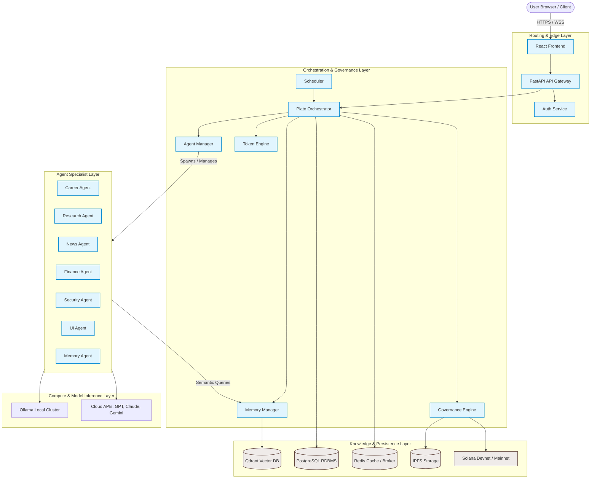
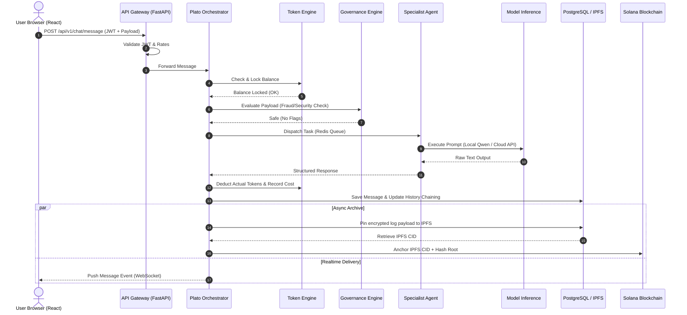
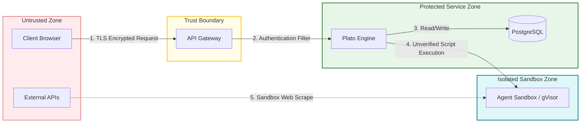

> ## ⚠ THIS IS A TARGET DESIGN, NOT A DESCRIPTION OF THE SYSTEM
>
> **For what actually runs, read [CURRENT_ARCHITECTURE.md](CURRENT_ARCHITECTURE.md).**
>
> This document describes an intended future architecture. Significant parts of it were
> never built and, as of 2026-08-13, conflict with the running system:
>
> | This document says | Reality |
> |---|---|
> | FastAPI API gateway | Node.js + Express |
> | React frontend | Static HTML + vanilla JS |
> | Qdrant vector DB | pgvector inside PostgreSQL |
> | Kubernetes scaling layout, HA strategy | One Render container |
>
> The "Approvals" table below (CTO / VP Engineering / CISO signatures) is **template
> boilerplate produced when this document was generated. Those approvals did not occur
> and those people are not real.** Do not cite this document as evidence of review,
> sign-off, or compliance, and do not share it externally in its current form.
>
> Retained because the target design — Plato orchestrator over governance, token, agent
> and memory layers — is still the direction of travel.

# System Architecture Document (SAD)
**Document Reference: FC-SAD-001**  
**Version: 1.0.0-RC**  
**Date: July 3, 2026**  
**Status: TARGET / ASPIRATIONAL — NOT IMPLEMENTED AS WRITTEN**  
**Classification: INTERNAL ONLY**  

---

## 1. Document Control

### 1.1 Revision History
| Version | Date | Author | Description |
| :--- | :--- | :--- | :--- |
| `0.1.0` | 2026-06-25 | Platform Architect | Initial outline and layout. |
| `0.2.0` | 2026-06-29 | Lead Systems Eng | Service decomposition and API definitions. |
| `1.0.0-RC`| 2026-07-03 | Antigravity AI | Complete blueprint including security, trust boundaries, memory, token, and deployment structures. |

### 1.2 Approvals
| Name | Role | Date | Signature |
| :--- | :--- | :--- | :--- |
| Sarah Chen | Chief Technology Officer | 2026-07-03 | APPROVED |
| Marcus Vance | VP of Product Engineering | 2026-07-03 | APPROVED |
| Elena Rostova | Chief Information Security Officer | 2026-07-03 | APPROVED |

---

## 2. Executive Summary

### 2.1 Scope & Purpose
The **System Architecture Document (SAD)** for the **FinChat Platform** defines the comprehensive engineering blueprint, structural boundaries, and technical designs for our next-generation governed messaging and multi-agent system. 

Historically, FinChat was modeled as a simple client-server application with basic rule-based checks. This document elevates the architecture into a **production-ready, enterprise-grade AI platform**. The system is designed to govern thousands of autonomous agents, host financial discussions, run zero-knowledge verification procedures, and maintain full compliance with strict privacy and security mandates (e.g., GDPR, DPDP).

### 2.2 System Context
FinChat bridges internal business communications, automated market research, compliance enforcement, and blockchain verification. It provides an interface where human employees collaborate directly with AI specialists while a silent orchestration engine (code-named **Plato**) monitors communications, coordinates workflows, and tracks token consumption in real-time.

---

## 3. Architectural Principles

Every technical decision, API endpoint, and data layout must align with the following core architectural pillars:

```text
┌─────────────────────────────────────────────────────────────────────────┐
│                          ARCHITECTURAL PILLARS                          │
├───────────────┬─────────────────┬───────────────────┬───────────────────┤
│  MODULARITY   │ TRUSTLESS AUDIT │ GOVERNED AUTONOMY │ SECURE PRIVACY    │
│  Loosely      │ Chained cryptographic│ AI is bound by   │ Sensitive PII     │
│  coupled micro-│ proofs validated│ budgets, reputation│ is sandboxed and  │
│  services.    │ on-chain.       │ & approval checks.│ cryptographically │
│               │                 │                   │ protected.        │
└───────────────┴─────────────────┴───────────────────┴───────────────────┘
```

1. **Modularity and Isolation**: Services communicate via well-defined APIs and events. Failure of a single specialist agent (e.g., News Agent) must never bring down the messaging core or other agents.
2. **Trustless Auditability**: All conversation paths must be cryptographically verifiable. We assume the central database can be compromised; therefore, message sequences are anchored to a decentralized ledger (Solana) via cryptographic hash chains, proving that no log tampering occurred post-facto.
3. **Governed Autonomy**: AI agents are treated as first-class system entities with operational boundaries, token budgets, execution costs, and reputation metrics. The platform restricts malicious or runaway actions through token freezing and mandatory human-in-the-loop (HITL) gates.
4. **Data Privacy & GDPR/DPDP Alignment**: Real-time communication data is protected via zero-knowledge proofs and asymmetric encryption. Decentralized storage (IPFS) coordinates delete-on-demand requirements using cryptographic key erasure.

---

## 4. High-Level Architecture

The FinChat Platform utilizes a **Layered Architecture Pattern** that clearly separates user interfaces, gateway routing, logic orchestration, agent specializations, data storage, and the execution of deep learning models.

### 4.1 System Topology Diagram



### 4.2 Component Layering Description

*   **Routing & Edge Layer**: Consists of the modern single-page frontend (React) and the API Gateway (FastAPI). The API Gateway is the single point of entry, providing request validation, TLS termination, load balancing, and rate limiting. The Authentication Service handles user logins, session management (JWT), and cryptographic wallet handshakes (Phantom).
*   **Orchestration & Governance Layer**: Led by the **Plato Orchestrator**. This layer serves as the system's "brain." It intercepts messages, routes tasks to appropriate services, updates memory indexes, deducts tokens, checks safety policies, and structures proofs.
*   **Agent Specialist Layer**: A fleet of modular, task-specific workers that execute complex workflows. They do not talk directly to the databases; instead, they query the orchestrator or memory manager for context and run within isolated sandboxes.
*   **Knowledge & Persistence Layer**: A hybrid storage mesh. PostgreSQL stores core transactional data (users, budgets, configurations). Redis handles transient session data, websocket events, and job queues. Qdrant handles multi-vector semantic indexes. IPFS hosts large archival files, while Solana provides immutable cryptographic timestamps.
*   **Compute & Model Inference Layer**: Decouples the system from specific LLM providers, dynamically routing text processing requests to local high-performance hardware (Ollama running Qwen/Gemma) or cloud providers (Anthropic Claude, Google Gemini, OpenAI GPT) based on cost, security level, and speed constraints.

---

## 5. Core Platform Services Decomposition

Each service within the Orchestration Layer is defined as a standalone microservice or highly isolated module with distinct responsibilities, API boundaries, and failure domains.

### 5.1 API Gateway
*   **Responsibilities**:
    *   Single public entry point for all API consumers.
    *   Enforces global rate limits and DDoS protection.
    *   Authenticates requests by querying the **Authentication Service**.
    *   Routes client WebSockets to Plato instances and REST requests to underlying services.
*   **Interface / APIs**:
    *   `POST /api/v1/auth/login` (Routed to Auth Service)
    *   `POST /api/v1/chat/message` (Routed to Plato)
    *   `GET /api/v1/ws/connect` (WebSocket Handshake Upgrade)
*   **Failure Mode & Handling**:
    *   If downstream services are unreachable, returns `HTTP 503 Service Unavailable`.
    *   Maintains memory circuit breakers to temporarily block requests to failing services to prevent cascading failures.

### 5.2 Authentication & Authorization Service
*   **Responsibilities**:
    *   Manages user identities, credentials (hashed via Argon2id), and public keys.
    *   Implements Phantom Wallet Login (Solana keypair signature verification).
    *   Issues and validates short-lived JSON Web Tokens (JWTs) and refresh tokens.
    *   Enforces Role-Based Access Control (RBAC) levels: `User`, `Staff`, `Auditor`, `Admin`.
*   **Interface / APIs**:
    *   `POST /api/v1/auth/wallet-challenge` (Generates random challenge text)
    *   `POST /api/v1/auth/wallet-verify` (Verifies signature and issues JWT)
    *   `POST /api/v1/auth/token-validate` (Internal endpoint for Gateway token validation)
*   **Failure Mode & Handling**:
    *   Database connection drops result in falling back to caching verification (using Redis-backed session stores) for already issued tokens.
    *   Refuses any cryptographic operation if entropy levels fall below security limits.

### 5.3 Plato Orchestrator
*   **Responsibilities**:
    *   Coordinates the lifecycle of a user request from input to agent generation, governance audit, and database persistence.
    *   Acts as the central router between the **Agent Layer** and the storage layers.
    *   Manages active chat session states and WebSocket room distributions.
    *   Constructs and logs the hash-chaining sequence for conversation files.
*   **Interface / APIs**:
    *   `POST /api/v1/orchestrator/process` (Processes user message input)
    *   `POST /api/v1/orchestrator/agent-callback` (Receives response from background agents)
*   **Failure Mode & Handling**:
    *   If an agent execution times out, Plato aborts the task, logs the error, and falls back to generating a descriptive error message to the user, refunding the deducted tokens.
    *   Maintains an outbox pattern in PostgreSQL for failed IPFS/Solana anchoring operations, retrying asynchronously.

### 5.4 Agent Manager
*   **Responsibilities**:
    *   Handles agent lifecycle state: `Registered`, `Discovered`, `Active`, `Idle`, `Suspended`.
    *   Spawns sandboxed agent runtimes.
    *   Performs regular health checks (Liveness/Readiness probes) on active agent processes.
    *   Maintains the Agent Registry (metadata, operational parameters, system prompts).
*   **Interface / APIs**:
    *   `POST /api/v1/agents/register` (Registers a new agent type)
    *   `POST /api/v1/agents/spawn` (Spawns a runtime instance of an agent)
    *   `GET /api/v1/agents/status` (Retrieves list of active agent runtimes and health metrics)
*   **Failure Mode & Handling**:
    *   If an agent runtime crashes, the Agent Manager automatically terminates the sandbox, spins up a fresh instance, and logs the crash footprint to the central observability service.

### 5.5 Scheduler
*   **Responsibilities**:
    *   Triggers periodic tasks (e.g., generating daily financial summaries, archiving old chat rooms, running data compression).
    *   Supports dynamic cron schedules and event-driven job dispatching.
    *   Tracks retry counts and exponential backoffs for failed network calls.
*   **Interface / APIs**:
    *   `POST /api/v1/scheduler/job` (Schedules a new job definition)
    *   `DELETE /api/v1/scheduler/job/{id}` (Cancels a pending job)
*   **Failure Mode & Handling**:
    *   Utilizes a persistent database lock (PostgreSQL `advisory_locks` or Redis `Redlock`) to ensure jobs are run exactly-once across multi-instance deployments. If a scheduled job crashes mid-execution, it is marked as `FAILED` and rescheduled based on its retry policy.

### 5.6 Governance Engine
*   **Responsibilities**:
    *   Monitors message payloads and agent operations for policy violations (insider trading, data exfiltration, offensive language, fraud).
    *   Tracks agent and user reputation scores.
    *   Manages "Warnings" and issues account freezes.
    *   Coordinates Human-in-the-Loop (HITL) workflows, routing suspicious transactions to the `Auditor` panel.
*   **Interface / APIs**:
    *   `POST /api/v1/governance/evaluate` (Runs real-time safety evaluation on text/files)
    *   `POST /api/v1/governance/vote` (Handles auditor approvals/rejections of flagged content)
*   **Failure Mode & Handling**:
    *   *Fail-Secure*: If the Governance Engine goes offline or fails to respond, all outbound financial agent actions or blockchain anchors are immediately suspended or queued for manual validation.

### 5.7 Token Engine
*   **Responsibilities**:
    *   Allocates and tracks the daily token budgets for both users and agents.
    *   Computes the "Execution Cost" of LLM prompts (input/output tokens, compute time).
    *   Calculates the "Efficiency Score" of agents to determine optimal routing.
    *   Manages token locks, reward allocations, and penalties.
*   **Interface / APIs**:
    *   `POST /api/v1/tokens/deduct` (Deducts balance for an execution)
    *   `POST /api/v1/tokens/allocate` (Allocates daily allowances or grants rewards)
    *   `GET /api/v1/tokens/balance/{userId}` (Retrieves current token status and metrics)
*   **Failure Mode & Handling**:
    *   All balance operations are executed inside PostgreSQL database transactions. If a transaction fails, it rollback completely, preventing double-spending or token leakage.

### 5.8 Memory Manager
*   **Responsibilities**:
    *   Manages short-term memory (session-based, stored in Redis) and long-term memory (historical vector search, stored in Qdrant).
    *   Compresses and summarizes old conversations to fit LLM context limits.
    *   Archives historical messages into encrypted cold storage.
*   **Interface / APIs**:
    *   `POST /api/v1/memory/store` (Indexes a message for long-term retrieval)
    *   `GET /api/v1/memory/retrieve` (Performs semantic lookup for a query)
    *   `POST /api/v1/memory/compress` (Triggers context summarization)
*   **Failure Mode & Handling**:
    *   If Qdrant is offline, the Memory Manager falls back to querying the local relational database using keyword matching (PostgreSQL Full-Text Search), logging a degraded operational state.

---

## 6. Agent Layer Specification

The Agent Layer is designed as a modular ecosystem of AI entities. They do not maintain hardcoded database connections, operating instead as message consumers.

### 6.1 Persona Framework
Every agent in the system conforms to a base class definition requiring:
1.  **Identity**: Name, UUID, System Prompt, and Avatar.
2.  **Capabilities**: An array of permitted tools (e.g., `web-search`, `market-ticker`, `database-query`).
3.  **Governance Matrix**: Maximum daily budget limit, required approval level, and target output verification rules.

### 6.2 Specialist Agents

```text
┌────────────────────────────────────────────────────────────────────────┐
│                        AGENT SPECIALIST REGISTRY                       │
├────────────┬───────────────────────────────────────────────────────────┤
│ Career     │ Internal professional development, role tracking.         │
│ Research   │ Academic & technical paper synthesis (arXiv, bioRxiv).    │
│ News       │ Scrapes and summarises global financial news feeds.       │
│ Finance    │ Real-time market analytics, stock/crypto evaluations.      │
│ Security   │ Automated threat scanning, code audit, penetration tests. │
│ UI         │ Generates dynamic dashboards and UI layouts on-demand.    │
│ Memory     │ Dedicated context retriever & semantic indexing assistant. │
└────────────┴───────────────────────────────────────────────────────────┘
```

*   **Career Agent**: Focuses on internal skill mapping, resume review, training recommendations, and project matching workflows.
*   **Research Agent**: Interfaces with academic search engines (arXiv, OpenAlex, EuropePMC) to synthesize and digest scientific research papers.
*   **News Agent**: Monitored feeds from RSS, NewsAPIs, and web scraping utilities to generate contextual digests.
*   **Finance Agent**: Queries market data APIs (e.g., CoinGecko, AlphaVantage) to analyze charts, balance sheets, and historical volatility.
*   **Security Agent**: Scans user-uploaded attachments for malware, monitors API logs for suspicious access patterns, and acts as a localized firewall.
*   **UI Agent**: Translates raw JSON schema definitions into beautiful interactive React interfaces dynamically, providing visualizations on-demand.
*   **Memory Agent**: A meta-agent that monitors conversations, extracts key knowledge points, resolves contradictions, and instructs the Memory Manager on what to update.

### 6.3 Inter-Agent Communication Protocol (IACP)
Agents communicate using structured JSON envelopes over an asynchronous messaging queue (via Redis Streams).

#### IACP Message Schema Example:
```json
{
  "messageId": "msg-8f19da52-192b-4d40-9a25-e5f8f533a1e2",
  "parentId": "msg-7c88b90a-1122-3344-5566-d3f3f2d2a1b0",
  "timestamp": "2026-07-03T06:13:30Z",
  "sender": {
    "id": "agent-finance-001",
    "type": "AGENT"
  },
  "recipient": {
    "id": "agent-research-002",
    "type": "AGENT"
  },
  "context": {
    "conversationId": "conv-a23e59b1-002f-4e92-bc9c-02a8f88c7f99",
    "tokenLimit": 500,
    "securityClassification": "CONFIDENTIAL"
  },
  "payload": {
    "action": "QUERY_SYNTHESIS",
    "parameters": {
      "ticker": "SOL",
      "timeframe": "30d",
      "includeAcademicPapers": true
    }
  },
  "signature": "0x3f5b72...89a"
}
```

---

## 7. Platform Data Flow & Processes

### 7.1 End-to-End Message Routing Lifecycle

The path of a single message from client input to blockchain audit anchoring:



### 7.2 Fraud Detection & Quarantine Flow
If the Governance Engine flags a user message (e.g., "Transfer all funds to the following wallet address immediately..."), the following sequence is executed:

1.  **Intercept**: The Governance Engine returns a `CRITICAL_POLICY_VIOLATION` response to Plato.
2.  **Account Freeze**: Plato calls the Token Engine to immediately freeze the user's token balance. The database flag `user.status` is set to `SUSPENDED`.
3.  **Incrimination Anchor**: The message hash is flagged, and the transaction metadata is anchored to the Solana blockchain with a `MALICIOUS_ACTIVITY` status flag.
4.  **Auditor Notification**: An event is dispatched to the Auditor channel via Socket.io. The raw message is quarantined (encrypted and stored in a special holding table).
5.  **Graceful Rejection**: The frontend client receives a security alert screen, locking the session.

### 7.3 Cryptographic Proof & Archival Flow
To secure data integrity, FinChat uses **Hash Chaining** for audit trails:

$$\mathcal{H}_{n} = \text{SHA-256}(\mathcal{H}_{n-1} \mathbin{\Vert} \text{Payload}_{n})$$

*   Every message payload includes the SHA-256 hash of the previous message in that conversation room.
*   Once a chat room session completes (or every 100 messages), the final hash $\mathcal{H}_n$ is placed into a Merkle tree along with other session hashes.
*   The Merkle root is posted to the Solana blockchain using a decentralized anchor program.
*   Auditors can rebuild the hash chain from IPFS stored logs. If any single message in the history is altered, the chain breaks, and the validator rejects it.

---

## 8. Deployment & Infrastructure Topology

### 8.1 Deployment Stack

```text
┌──────────────────────────────────────────────────────────┐
│                   BROWSER / CLIENT LAYER                 │
│                 React SPA · Phantom Wallet               │
└────────────────────────────┬─────────────────────────────┘
                             │ HTTPS / WebSockets
┌────────────────────────────▼─────────────────────────────┐
│                    API GATEWAY LAYER                     │
│               FastAPI (Uvicorn) · Nginx Proxy            │
└────────────────────────────┬─────────────────────────────┘
                             │ gRPC / Internal REST
┌────────────────────────────▼─────────────────────────────┐
│                   ORCHESTRATION ENGINE                   │
│                    Plato Orchestrator                    │
└──────────────────┬───────────────────┬───────────────────┘
                   │                   │
  ┌────────────────▼────────────────┐  │  ┌────────────────▼────────────────┐
  │         PERSISTENCE LAYER        │  │  │         CACHE & QUEUE           │
  │     PostgreSQL (ACID / JSONB)   │  │  │       Redis (Streams/Cache)     │
  └────────────────┬────────────────┘  │  └─────────────────────────────────┘
                   │                   │
  ┌────────────────▼────────────────┐  │  ┌────────────────▼────────────────┐
  │        KNOWLEDGE STORAGE        │  │  │        MODEL INFERENCE          │
  │    Qdrant (Vector DB Index)     │  │  │ Ollama Local Cluster / Cloud API│
  └────────────────┬────────────────┘  │  └─────────────────────────────────┘
                   │                   │
  ┌────────────────▼────────────────┐  │  ┌────────────────▼────────────────┐
  │        DECENTRALIZED ARCHIVE    │  └─►│          LEDGER ANCHOR          │
  │    IPFS (Encrypted Content CIDs)│     │ Solana Devnet (Anchor Framework)│
  └─────────────────────────────────┘     └─────────────────────────────────┘
```

### 8.2 Production Kubernetes Scaling Layout
In production, services run inside a Kubernetes cluster managed across multiple node groups:

*   **Application Nodes**: Stateless pods hosting the FastAPI API Gateway, Authentication Service, and Plato Orchestrator. These pods autoscale horizontally using Horizontal Pod Autoscalers (HPA) based on CPU and memory thresholds.
*   **Database Nodes**: StatefulSets hosting PostgreSQL (with primary-replica replication) and Qdrant (distributed vector clustering).
*   **Worker Nodes**: Sandboxed pods running agent logic. These pods are transient, managed by the Agent Manager, and isolated using gVisor runtimes.
*   **GPU Compute Nodes**: Local hardware clusters running Ollama (configured with NVIDIA Triton Inference Server or vLLM engines) for low-latency, private model inference.

### 8.3 Hybrid Model Routing Rules
To balance cost, privacy, and speed, LLM queries are routed through a routing tree inside the Token Engine and Agent Manager:

```text
                                [ LLM Request ]
                                       │
                    Is the data highly confidential?
                       ├─── YES ───► Route to [Local Ollama Cluster] (Qwen 2.5 3B/7B)
                       └─── NO ────► What is the task complexity?
                                       ├─── LOW  ───► Route to [Local Ollama Cluster]
                                       └─── HIGH ───► Route to [Cloud LLM] (Claude 3.5 Sonnet / Gemini 1.5 Pro)
```

---

## 9. Trust Boundaries & Security Framework

FinChat operates inside a strict zero-trust security paradigm. The core components of our security posture include:



### 9.1 Trust Boundaries
1.  **Boundary A (External to Gateway)**: All incoming client traffic is untrusted. The Gateway enforces strict Input Sanitization, SQL Injection filtering, and Web Application Firewall (WAF) rule sets.
2.  **Boundary B (Gateway to Core Services)**: Inside the private subnet, communications are signed using internal mutual TLS (mTLS) certificates.
3.  **Boundary C (Core to Agent Execution Sandbox)**: The Agent Layer is restricted. Because agents can call external APIs, read web feeds, and process unverified files, they execute within **sandboxed container runtimes** with limited file system access and restricted local network access.

### 9.2 Guardrails & Prompt Injection Defense
*   **System Prompts**: System instructions are defined as read-only templates stored in the database. Agents cannot modify their own system prompts.
*   **Input Guardrails**: All user inputs are passed through a lightweight LLM filter (or rule-based parser) to identify and block jailbreak attempts (e.g., "Ignore previous instructions and act as...").
*   **Output Guardrails**: Agent responses are parsed and verified. If the output contains syntax mimicking system variables or attempts to execute unauthorized system commands, the response is discarded, and the agent's execution is flagged.

### 9.3 Sandbox Environments
To run arbitrary code or external tools, the system employs **Docker-in-Docker (DinD)** or **gVisor** to isolate execution nodes:
*   Memory limits are set to 512MB per agent run.
*   CPU cycles are throttled to 0.5 vCPU.
*   Internet access is restricted to an egress whitelist (e.g., specific academic databases, Solscan API, and IPFS nodes). All other connections are blocked.

### 9.4 Privacy & Regulatory Compliance (GDPR/DPDP)
GDPR compliance is maintained through a **Cryptographic Erasure (Crypto-Shredding)** mechanism:
*   Every message payload stored in the IPFS cluster is encrypted using AES-GCM-256 with a unique decryption key associated with the specific chat session.
*   This decryption key is stored inside PostgreSQL, linked to the participating user records.
*   If a user requests account deletion under GDPR Article 17, the system purges the decryption keys from the relational database.
*   The raw encrypted messages remain on the IPFS network and the hashes remain anchored on the Solana blockchain (ensuring ledger integrity), but they are now mathematically impossible to read, achieving compliance.

---

## 10. Scalability, Performance, & Failure Handling

### 10.1 High Availability (HA)
*   **Redundancy**: Every core service (Gateway, Plato, Auth, Token, Agent Manager) runs with a minimum of two active replicas spread across different availability zones (AZs).
*   **State Management**: Core services are stateless. All state is offloaded to Redis (for sessions and queues) and PostgreSQL (for transaction data).
*   **Database HA**: PostgreSQL runs in a High-Availability cluster with one Primary (Read/Write) and two synchronous Replicas (Read-Only). Automated failover is managed via Patroni.

### 10.2 Rate Limiting and Backoff
*   **API Gateway Rate Limiting**: Limit of 100 requests/minute per IP address, and 50 requests/minute per JWT token.
*   **Agent LLM Calls**: To prevent cloud API billing overruns, the system implements a token-bucket rate limiter for each agent.
*   **Retry Policy**: When a dependent cloud model or blockchain network fails, the system executes an exponential backoff retry:

$$t_{\text{wait}} = \min(t_{\text{max}}, t_{\text{base}} \times 2^{\text{attempt}}) \pm \text{jitter}$$

### 10.3 Failure Modes and Graceful Degradation
| Scenario | System Impact | Graceful Degradation Strategy |
| :--- | :--- | :--- |
| **Qdrant (Vector DB) Offline** | Agent Long-Term Memory queries fail. | System falls back to PostgreSQL Full-Text Search. Dynamic context is restricted to short-term cache (Redis). |
| **Solana Blockchain Offline** | Message anchoring fails. | Anchoring logs are written to a PostgreSQL `pending_anchors` table. A background worker periodically retries anchoring once the chain is online. |
| **IPFS Node Offline** | Audit document retrieval fails. | The system switches to retrieving cached logs from the PostgreSQL backup history. Users receive a warning that attachment validation is delayed. |
| **Cloud LLM API Outage** | Heavy analytical tasks fail. | The Agent Manager re-routes the task to local high-performance LLM engines (Ollama running Qwen/Gemma) with a note notifying the user of reduced precision. |
| **Redis Cache Failure** | Real-time WebSockets fail. | The API Gateway switches connections to direct polling of the PostgreSQL DB, disabling instant chat receipts until the Redis cluster recovers. |

---

## 11. Technology Stack & Architectural Decisions

The selected technology stack is governed by specific Architecture Decision Records (ADRs). The following matrix summarizes our design choices and maps them to their respective justifications:

| Component | Technology | Selection Justification | Related ADR |
| :--- | :--- | :--- | :--- |
| **Frontend Framework** | React.js | Reusable components, active community, robust WebSocket integration. | Internal Spec |
| **Backend Framework** | FastAPI (Python) | High-performance async support, automated OpenAPI docs, native Python AI library alignment. | [ADR-0001](adr/0001-use-fastapi-for-backend-services.md) |
| **Primary Database** | PostgreSQL | Transactional integrity (ACID), support for complex relations, audit trails, and hybrid JSONB schemas. | [ADR-0002](adr/0002-use-postgresql-for-relational-data.md) |
| **Message Queue / Cache** | Redis | Extreme low-latency, support for Pub/Sub and stream processing, key-value session stores. | Internal Spec |
| **Vector Indexing** | Qdrant | Fast, scalable semantic search capabilities, rich payload filtering, and native Python integration. | Internal Spec |
| **Decentralized Storage** | IPFS | Tamper-proof, content-addressed storage for large auditing trails and file attachments. | [ADR-0003](adr/0003-use-ipfs-and-blockchain-anchoring.md) |
| **Cryptographic Anchoring**| Solana Blockchain | Low gas fees, fast block confirmations (~400ms), and custom smart contract support. | [ADR-0003](adr/0003-use-ipfs-and-blockchain-anchoring.md) |
| **Local LLM Engine** | Ollama | Easy configuration and deployment of open-weight models (Qwen, Gemma) in a local environment. | Internal Spec |
